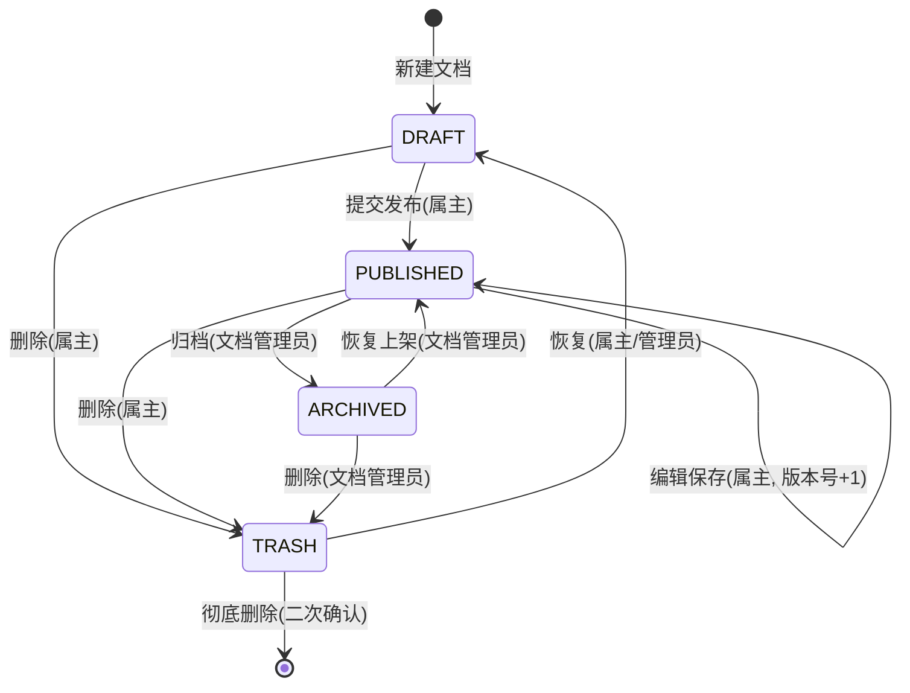

# PRD：CampusSwap 文档管理平台 · 产品需求规格说明书

| 项 | 值 |
|---|---|
| 文件 | `docs/01-requirements/PRD.md` |
| 版本 | v1.0（M0 产出） |
| 日期 | 2026-09-21 |
| 状态 | **Frozen（已冻结）** |
| 上游依据 | `USER_STORIES.md`（8 个故事 / 24 条 AC）、`docs/MASTER-PLAN.md` §4 |
| 下游消费 | 接口设计（`docs/02-design/API-SPEC.md`）、`backend/sql/schema.sql`、前端页面开发 |

---

> **变更记录 v2.1（M1，2026-09-21）**：对齐老师《1.2 示例-数据库物理建表脚本(MySQL版)》口径 —— 主键改 `BIGINT AUTO_INCREMENT`（原：雪花禁用自增）；审计列改 `created_at / created_by / updated_at / updated_by / deleted`；中间表改**复合主键、无 `id` 列**（新增 `_rel` 后缀）；`sys_login_log` 换成 `sys_user_permission`（支撑权限合并算法的"直授"分支）；`sys_user` 取消 `role_code` 列（角色一律走 `sys_user_role` 中间表）；用户启停由 `is_enabled` 改为 `status` 三态（`ACTIVE` / `LOCKED` / `DISABLED`）。

---

## 1. 系统概述与 MVP 边界

### 1.1 一句话定位

面向单位内部的 **Markdown 文档管理平台**：员工把知识沉淀成文档，凭权限检索与复用，管理员治理内容与授权。

### 1.2 核心价值（三条，全部可验证）

| # | 价值 | 验证方式 |
|---|---|---|
| V1 | **写得快** —— 基于已有文档派生新文档，免除重复劳动 | US-05 |
| V2 | **找得到** —— 关键词 / 分类 / 标签三维检索，只返回有权看的内容 | US-04 |
| V3 | **管得住** —— 三层 RBAC 权限 + 文档状态机 + 审核留痕 | US-07、US-08 |

### 1.3 规模假设（本机单实例）

| 维度 | 假设值 | 对应设计取舍 |
|---|---|---|
| 用户数 | ≤ 500 | 不引入分库分表；权限可全量缓存 |
| 文档数 | ≤ 5 万 | MySQL `LIKE` + 索引足够，不引入 ES |
| 并发 | ≤ 50 | Tomcat 默认线程池足够；Redis 仅做缓存与计数 |
| 部署 | Windows 单机（Windows 10/11 + JDK17 + MySQL8 + Redis5） | 不引入 Docker / K8s |

---

## 2. 角色与权限矩阵

操作 × 角色（✅ 允许 / ⛔ 拒绝 / 🔸 仅限本人数据）

| 操作 | 游客 | STAFF | DOC_ADMIN | SYS_ADMIN |
|---|---|---|---|---|
| 登录 | ✅ | ✅ | ✅ | ✅ |
| 检索已发布文档 | ⛔ | ✅ | ✅ | ✅ |
| 查看文档详情 | ⛔ | ✅ | ✅ | ✅ |
| 新建文档 | ⛔ | ✅ | ✅ | ✅ |
| 编辑文档 | ⛔ | 🔸 | ✅ | ✅ |
| 提交发布 | ⛔ | 🔸 | ✅ | ✅ |
| 删除（进回收站） | ⛔ | 🔸 | ✅ | ✅ |
| 恢复 / 彻底删除 | ⛔ | 🔸 | ✅ | ✅ |
| 派生文档 | ⛔ | ✅ | ✅ | ✅ |
| 收藏 / 取消收藏 | ⛔ | ✅ | ✅ | ✅ |
| 上传图片 | ⛔ | ✅ | ✅ | ✅ |
| 审核通过 / 驳回 | ⛔ | ⛔ | ✅ | ✅ |
| 归档 / 下架 | ⛔ | ⛔ | ✅ | ✅ |
| 维护分类与标签 | ⛔ | ⛔ | ✅ | ✅ |
| 用户管理 | ⛔ | ⛔ | ⛔ | ✅ |
| 角色管理 | ⛔ | ⛔ | ⛔ | ✅ |
| 权限管理 | ⛔ | ⛔ | ⛔ | ✅ |
| 部门管理 | ⛔ | ⛔ | ⛔ | ✅ |

> 矩阵中的每一格都由后端 `@RequiresPermission` + Service 层归属校验双重保证，**不依赖前端隐藏按钮**。

---

## 3. 权限模型（三层 RBAC）

### 3.1 树形结构

`sys_permission` 用 `parent_id`（直接父节点）+ `ancestors`（祖级路径，逗号分隔，如 `0,1,5`）表达三层树：

| `type` | 层级 | 说明 | 前端表现 |
|---|---|---|---|
| 1 | 目录层 | 一级导航 | 左侧一级菜单组 |
| 2 | 菜单层 | 二级页面 | 左侧菜单项 / 路由 |
| 3 | 按钮层 | 具体动作 | 页面按钮显隐 + 接口鉴权 |

### 3.2 权限点全清单（共 39 个）

**目录层（2）**

| 权限码 `code` | 名称 |
|---|---|
| `doc:center` | 文档中心 |
| `sys:center` | 系统管理 |

**菜单层（9）**

| 权限码 `code` | 名称 | 父节点 |
|---|---|---|
| `doc:mine` | 我的文档 | `doc:center` |
| `doc:search` | 文档检索 | `doc:center` |
| `doc:review` | 审核队列 | `doc:center` |
| `doc:manage` | 文档治理 | `doc:center` |
| `doc:category` | 分类与标签 | `doc:center` |
| `sys:user` | 用户管理 | `sys:center` |
| `sys:role` | 角色管理 | `sys:center` |
| `sys:perm` | 权限管理 | `sys:center` |
| `sys:dept` | 部门管理 | `sys:center` |

**按钮层（28）**

| 权限码 `code` | 名称 | 父节点 |
|---|---|---|
| `doc:create` | 新建文档 | `doc:mine` |
| `doc:edit` | 编辑文档 | `doc:mine` |
| `doc:publish` | 提交发布 | `doc:mine` |
| `doc:delete` | 删除文档 | `doc:mine` |
| `doc:restore` | 恢复文档 | `doc:mine` |
| `doc:derive` | 派生文档 | `doc:search` |
| `doc:favorite` | 收藏文档 | `doc:search` |
| `doc:upload` | 上传图片 | `doc:search` |
| `doc:audit` | 审核通过 | `doc:review` |
| `doc:reject` | 驳回文档 | `doc:review` |
| `doc:archive` | 归档文档 | `doc:manage` |
| `doc:offline` | 下架文档 | `doc:manage` |
| `doc:category:edit` | 维护分类 | `doc:category` |
| `doc:tag:edit` | 维护标签 | `doc:category` |
| `sys:user:add` | 新增用户 | `sys:user` |
| `sys:user:edit` | 编辑用户 | `sys:user` |
| `sys:user:disable` | 停用/启用用户 | `sys:user` |
| `sys:user:reset` | 重置密码 | `sys:user` |
| `sys:role:add` | 新增角色 | `sys:role` |
| `sys:role:edit` | 编辑角色 | `sys:role` |
| `sys:role:delete` | 删除角色 | `sys:role` |
| `sys:role:grant` | 角色授权 | `sys:role` |
| `sys:perm:add` | 新增权限 | `sys:perm` |
| `sys:perm:edit` | 编辑权限 | `sys:perm` |
| `sys:perm:delete` | 删除权限 | `sys:perm` |
| `sys:dept:add` | 新增部门 | `sys:dept` |
| `sys:dept:edit` | 编辑部门 | `sys:dept` |
| `sys:dept:delete` | 删除部门 | `sys:dept` |

### 3.3 角色默认授权

| 角色 | 默认权限点 |
|---|---|
| `STAFF` | `doc:center`、`doc:mine`、`doc:search`、`doc:create`、`doc:edit`、`doc:publish`、`doc:delete`、`doc:restore`、`doc:derive`、`doc:favorite`、`doc:upload` |
| `DOC_ADMIN` | STAFF 全部 + `doc:review`、`doc:manage`、`doc:category`、`doc:audit`、`doc:reject`、`doc:archive`、`doc:offline`、`doc:category:edit`、`doc:tag:edit` |
| `SYS_ADMIN` | 全部 39 个权限点 |

### 3.4 权限合并算法（登录时执行一次，写 Redis）

```
入参：userId
1. 查 sys_user → 得 dept_id
2. 角色集合 = sys_user_role(user_id = userId) ∪ sys_dept_role(dept_id = user.dept_id)
3. 权限集合 = sys_role_permission(role_id ∈ 角色集合) ∪ sys_user_permission(user_id = userId)
4. 去重 → 权限码集合 Set<String>（取 sys_permission.code，deleted = 0）
5. 缓存：Redis key = perm:user:{userId}，TTL = 30 分钟
```

**失效时机**：角色权限变更 / 用户角色变更 / 部门角色变更 / 用户停用 → 立即 `DEL perm:user:{userId}`；Redis 不可用时降级为每次直查数据库（功能不中断，只变慢）。

---

## 4. 文档全生命周期状态机

### 4.1 状态图



### 4.2 状态转移表

| # | 源状态 | 事件 | 触发角色 | 前置条件 | 目标状态 | 副作用 |
|---|---|---|---|---|---|---|
| T1 | — | 新建 | STAFF+ | 有 `doc:create`；标题非空 | `DRAFT` | `version_num=1`，写 `doc_version` |
| T2 | `DRAFT` | 提交发布 | 属主 | 有 `doc:publish`；正文非空 | `PUBLISHED` | `version_num+1`，`publish_at=now`，写版本 |
| T3 | `DRAFT` | 删除 | 属主 | 有 `doc:delete` | `TRASH` | `deleted=1`，记 `update_by` |
| T4 | `PUBLISHED` | 编辑保存 | 属主 | 有 `doc:edit` | `PUBLISHED` | `version_num+1`，写版本 |
| T5 | `PUBLISHED` | 归档 | DOC_ADMIN | 有 `doc:archive`；意见非空 | `ARCHIVED` | 写审核记录 |
| T6 | `PUBLISHED` | 删除 | 属主 | 有 `doc:delete` | `TRASH` | `deleted=1` |
| T7 | `ARCHIVED` | 恢复上架 | DOC_ADMIN | 有 `doc:archive` | `PUBLISHED` | 清空 `reject_reason` |
| T8 | `ARCHIVED` | 删除 | DOC_ADMIN | 有 `doc:delete` | `TRASH` | `deleted=1` |
| T9 | `TRASH` | 恢复 | 属主/DOC_ADMIN | 有 `doc:restore` | `DRAFT` | `deleted=0` |
| T10 | `TRASH` | 彻底删除 | 属主/DOC_ADMIN | 有 `doc:delete`；二次确认参数 | 物理删除 | 级联清理 `doc_version`、`doc_favorite`、标签关联 |

### 4.3 状态不变式（Invariants）

| # | 不变式 | 校验位置 |
|---|---|---|
| I1 | 只有 `DRAFT` 与 `PUBLISHED` 允许修改正文；`ARCHIVED` 只读 | Service |
| I2 | `version_num` 单调递增，任何正文写入都 +1 | Service |
| I3 | 无死胡同：每个状态至少有一条出边（T2/T3、T4/T5/T6、T7/T8、T9/T10） | 本表 |
| I4 | `TRASH` 之外的文档才出现在检索结果中 | Repository 查询条件 |
| I5 | 非法转移一律 409 `CONFLICT_STATUS`，不做静默容错 | 统一异常处理 |

---

## 5. 功能模块详规

### 5.1 模块一：系统与权限管理

| # | 功能 | 输入 | 业务规则 | 输出 | 异常 | 权限点 |
|---|---|---|---|---|---|---|
| F1-01 | 登录 | 用户名、密码 | 用户名去空格；密码 BCrypt 校验；停用用户拒绝；签发 token 写 Redis | `LoginVo`：token + 用户信息 + 权限码数组 | 401 凭据错误、403 账号停用 | 公开 |
| F1-02 | 登出 | token | token 加入 Redis 黑名单至其自然过期 | 空 | 401 | 登录即可 |
| F1-03 | 获取当前用户 | token | 从 Redis 取权限集合 | `UserInfoVo` | 401 | 登录即可 |
| F1-04 | 用户列表 | 关键词、部门、状态、分页 | 不返回 `password_hash` | 分页 `UserVo` | — | `sys:user` |
| F1-05 | 新增用户 | 工号、姓名、部门、角色、初始密码 | 工号唯一；密码强度 ≥8 位含字母数字 | 新用户 ID | 400 工号重复 | `sys:user:add` |
| F1-06 | 编辑用户 | 姓名、部门、角色 | 不在此接口改密码 | 空 | 404 | `sys:user:edit` |
| F1-07 | 变更用户状态 | userId、`status`（ACTIVE / LOCKED / DISABLED） | 改为非 ACTIVE 即强制下线（清该用户全部 token + 权限缓存） | 空 | 404 | `sys:user:disable` |
| F1-08 | 重置密码 | userId、新密码 | 更新后清空该用户所有 token | 空 | 400 强度不足 | `sys:user:reset` |
| F1-09 | 角色列表/详情 | 分页 | — | `RoleVo` | — | `sys:role` |
| F1-10 | 角色增删改 | 角色名、编码、描述 | 编码唯一且不可修改；被用户引用时禁止删除 | 空 | 400/409 | `sys:role:add/edit/delete` |
| F1-11 | 角色授权 | roleId、permIds | 覆盖式保存；保存后清空该角色下所有用户权限缓存 | 空 | 404 | `sys:role:grant` |
| F1-12 | 权限树 | — | 按 `parent_id` 递归组装；一次性返回全树 | 树形 `PermissionVo` | — | `sys:perm` |
| F1-13 | 权限增删改 | 权限名、编码、类型、父节点 | 删除前须无子节点且未被角色引用；禁止移动到自身子孙节点 | 空 | 400/409 | `sys:perm:add/edit/delete` |
| F1-14 | 部门树 | — | 复用 `parent_id + ancestors` | 树形 `DeptVo` | — | `sys:dept` |
| F1-15 | 部门增删改 | 部门名、父部门 | 存在子部门或有在职用户时禁止删除 | 空 | 400/409 | `sys:dept:add/edit/delete` |
| F1-16 | 部门绑定角色 | deptId、roleIds | 覆盖式保存；变更后清空该部门用户权限缓存 | 空 | 404 | `sys:role:grant` |

### 5.2 模块二：文档业务管理

| # | 功能 | 输入 | 业务规则 | 输出 | 异常 | 权限点 |
|---|---|---|---|---|---|---|
| F2-01 | 新建草稿 | 标题、摘要、正文、分类、标签、价格标记 | 见 US-02；`created_by = 当前用户`（**作者即创建人**，不另设作者字段） | `DocumentVo` | 400 | `doc:create` |
| F2-02 | 我的文档列表 | 状态、关键词、分页 | 强制 `created_by = 当前用户`，前端不可传 | 分页 `DocumentVo` | — | `doc:mine` |
| F2-03 | 文档详情 | id | 非属主仅可见 `PUBLISHED`；`PUBLISHED` 阅读量 +1（30 分钟去重） | `DocumentDetailVo`（含 `contentMd`、权限标记 `canEdit`） | 403/404 | `doc:search` |
| F2-04 | 编辑保存 | id + 字段 | 归属校验 + 状态校验；版本号 +1 | `DocumentVo` | 403/409 | `doc:edit` |
| F2-05 | 提交发布 | id | `DRAFT → PUBLISHED` | 空 | 403/409 | `doc:publish` |
| F2-06 | 检索 | 关键词、分类、标签、排序、分页 | 仅 `PUBLISHED`；关键词命中标题或摘要（`LIKE`）；`pageSize ≤ 100` | 分页 `DocumentVo` | 400 | `doc:search` |
| F2-07 | 派生 | 源 id | 见 US-05 | 新 `DocumentVo` | 403/409 | `doc:derive` |
| F2-08 | 收藏 / 取消 | id | `(user_id, document_id)` 唯一；重复收藏幂等 | 收藏状态 | — | `doc:favorite` |
| F2-09 | 我的收藏 | 分页 | 仅返回自己收藏且可见的文档 | 分页 | — | `doc:favorite` |
| F2-10 | 删除 | id | 软删除进 `TRASH` | 空 | 403 | `doc:delete` |
| F2-11 | 恢复 | id | `TRASH → DRAFT` | 空 | 403/409 | `doc:restore` |
| F2-12 | 回收站列表 | 分页 | 仅属主自己的 | 分页 | — | `doc:mine` |
| F2-13 | 审核列表 | 状态、分页 | 默认 `PUBLISHED` 待治理 | 分页 | — | `doc:review` |
| F2-14 | 审核通过 / 驳回 | id、意见 | 意见必填；驳回写入 `reject_reason` 回传属主 | 空 | 400/404 | `doc:audit` / `doc:reject` |
| F2-15 | 归档 / 恢复上架 | id | 见 T5/T7 | 空 | 403/409 | `doc:archive` |
| F2-16 | 分类树增删改 | 分类名、父分类、排序 | 最多 3 层；删除前须先迁移该分类下文档 | 空 | 400/409 | `doc:category:edit` |
| F2-17 | 标签增删改 | 标签名 | 同名唯一；删除同时清关联 | 空 | 409 | `doc:tag:edit` |
| F2-18 | 图片上传 | multipart 文件 | 仅 jpg/png/webp/gif，≤5MB；存 `uploads/yyyy/MM/uuid.ext`；返回相对 URL | 图片 URL | 400 类型/大小 | `doc:upload` |
| F2-19 | 版本历史 | documentId | 按 `version_num` 倒序 | 版本列表 | 403 | `doc:mine` |
| F2-20 | 首页统计 | — | 我的文档数、收藏数、平台已发布数 | `StatVo` | — | `doc:center` |

---

## 6. 业务规则字典（Business Rules）

| # | 规则 |
|---|---|
| BR-01 | 一个用户只属于一个部门（`sys_user.dept_id`），但可拥有多个角色（`sys_user_role`）；内置角色由 `sys_role.code` 决定 |
| BR-02 | 角色 `sys_role.code` 全局唯一，创建后不可修改 |
| BR-03 | 权限节点删除前必须无子节点且未被任何角色引用 |
| BR-04 | 标题 1–128 字符、摘要 0–255 字符、正文 0–100000 字符，服务端与前端双重校验 |
| BR-05 | 分页 `pageNum ≥ 1`、`1 ≤ pageSize ≤ 100`（默认 10），越界一律 400，不静默纠正 |
| BR-06 | `version_num` 单调递增；任何正文写入或状态变更都新增一条 `doc_version` |
| BR-07 | 删除 = 软删除（`deleted=1`）进回收站；恢复后回到 `DRAFT` |
| BR-08 | 彻底删除仅允许操作 `TRASH` 中的文档，且必须携带二次确认标记 |
| BR-09 | 阅读量仅对 `PUBLISHED` 文档计数；同一用户在 30 分钟内重复打开不重复计数（Redis SETNX） |
| BR-10 | 收藏关系 `(user_id, document_id)` 唯一；重复收藏为幂等成功 |
| BR-11 | `ARCHIVED` 文档只读，任何写接口返回 409 |
| BR-12 | 审核意见（通过备注 / 驳回理由）必填，1–255 字符 |
| BR-13 | 分类树最多 3 层；删除分类前必须先把该分类下的文档迁移到其它分类 |
| BR-14 | 每篇文档最多 5 个标签，单标签 1–16 字符 |
| BR-15 | 图片仅支持 jpg/jpeg/png/webp/gif，单文件 ≤ 5MB，存储路径 `uploads/yyyy/MM/{uuid}.{ext}`，以相对 URL 入库 |
| BR-16 | 主键为 `BIGINT AUTO_INCREMENT`；返回前端时统一用 `@JsonSerialize(using = ToStringSerializer.class)` 序列化为**字符串**，前端类型一律 `string` |
| BR-17 | 价格/积分统一以「分」为单位的 `INT UNSIGNED` 存储（`price_cents`），前端展示时转换为元；本平台 `price_cents` 仅作「免费 / 积分」标记，不涉及真实支付 |
| BR-18 | 权限缓存 key `perm:user:{userId}`，TTL 30 分钟；授权变更即时失效；Redis 不可用时降级直查 DB |
| BR-19 | 登录 token 有效期 2 小时，登出后写入 Redis 黑名单直至自然过期 |
| BR-20 | 密码使用 BCrypt 加盐哈希存储，禁止明文、MD5、可逆加密 |
| BR-21 | 一切涉及已存在资源的读写接口，必须在 Service 层校验归属或权限（防平行越权 IDOR） |
| BR-22 | 时间统一使用 `Asia/Shanghai`，接口返回格式 `yyyy-MM-dd HH:mm:ss` |
| BR-23 | 接口统一响应体 `{ code, message, data }`，`code=200` 表示成功；错误码见 §7.1 |
| BR-24 | 所有实体不入参、不出参：入参用 DTO，出参用 VO，Entity 不跨出 Service |

### 6.1 统一错误码

| code | 语义 | HTTP |
|---|---|---|
| 200 | 成功 | 200 |
| 400 | 参数校验失败 / 业务规则拒绝 | 400 |
| 401 | 未登录或 token 失效（`UNAUTHORIZED`） | 401 |
| 403 | 已登录但无权限（`NO_PERMISSION`）/ 账号停用（`USER_DISABLED`） | 403 |
| 404 | 资源不存在 | 404 |
| 409 | 状态冲突（`CONFLICT_STATUS`）/ 唯一约束冲突 | 409 |
| 500 | 服务器内部错误（对外不暴露堆栈） | 500 |

---

## 7. 非功能性需求（NFR）

### 7.1 安全

| # | 要求 |
|---|---|
| NFR-S1 | 密码 BCrypt（strength 10）存储；日志与响应体中永不出现密码或哈希 |
| NFR-S2 | 登录失败提示不区分「用户不存在 / 密码错误」，防用户名枚举 |
| NFR-S3 | 所有 SQL 走 JPA 参数绑定，禁止字符串拼接（防注入） |
| NFR-S4 | Markdown 渲染前端须 sanitize，禁止执行内联脚本（防 XSS） |
| NFR-S5 | 数据库密码用环境变量占位 `${DB_PASSWORD:123456}`，仓库中不出现真实生产密码 |
| NFR-S6 | 上传文件校验扩展名 + MIME + 大小，文件名用 UUID 重命名（防路径穿越） |

### 7.2 性能与资源

| # | 要求 |
|---|---|
| NFR-P1 | 列表接口 P95 < 500 ms（1 万篇文档数据量下，本机实测） |
| NFR-P2 | 禁止 N+1 查询：列表接口用 `join fetch` 或批量 `IN` 查询补齐作者/分类名 |
| NFR-P3 | 本机 8GB 内存约束：JVM 启动参数 `-Xmx512m`，MySQL `innodb_buffer_pool_size=256M` |
| NFR-P4 | 列表接口一律分页，禁止无分页全表返回 |

### 7.3 可维护性与质量

| # | 要求 |
|---|---|
| NFR-M1 | 分层铁律：Controller 只做路由与 `@Valid`；Service 管业务与事务；Repository 只写 JPA；Entity 只映射表 |
| NFR-M2 | 每个表、每个字段都必须有 `COMMENT`（中文） |
| NFR-M3 | Service 层核心方法必须有单元测试；`./mvnw test` 必须全绿 |
| NFR-M4 | 前端 `pnpm run typecheck` 与 `pnpm run lint` 零错误 |
| NFR-M5 | 提交历史语义化：`feat:` / `fix:` / `docs:` / `chore:` 前缀 |

### 7.4 兼容性

| # | 要求 |
|---|---|
| NFR-C1 | 浏览器：Chrome / Edge 最新两个大版本；分辨率 ≥ 1366×768 |
| NFR-C2 | 后端 JDK 17 编译目标（本机同时装了 17.0.5 与 21.0.6，构建固定 17） |
| NFR-C3 | MySQL 8.0.x，字符集 `utf8mb4`、排序规则 `utf8mb4_unicode_ci`，引擎 InnoDB |

---

## 8. 显式非目标（Out of Scope）

以下内容在本次大作业中**明确不做**，任何人提出都需先变更本文档：

| # | 不做的事 | 原因 |
|---|---|---|
| O1 | 实时协同编辑（多人同时编辑一篇文档） | 需 WebSocket + OT/CRDT，超出课程范围 |
| O2 | Elasticsearch / 全文检索引擎 | MySQL `LIKE` 在 5 万篇内够用 |
| O3 | 真实支付、充值、订单流程 | `price_cents` 仅作免费/积分标记 |
| O4 | 移动端 App、微信小程序 | 仅做桌面 Web |
| O5 | 邮件 / 短信通知 | 站内消息与详情页展示驳回理由即可 |
| O6 | 多租户 SaaS 化 | 单单位内部使用 |
| O7 | Office（doc/xlsx/pptx）在线预览与格式转换 | 平台只处理 Markdown + 图片 |
| O8 | Docker / K8s / CI 流水线 | 教师环境为本机单实例部署 |
| O9 | 演示视频、答辩 PPT、部署上线 | 教师明确：**只看源码**，不做演示 |

---

## 9. 数据实体清单（14 张表）

详见 `GLOSSARY.md` §2 与 M1 产出的 `backend/sql/schema.sql`。

**系统域（8 张）**：`sys_user`、`sys_dept`、`sys_role`、`sys_permission`、`sys_user_role`、`sys_user_permission`、`sys_role_permission`、`sys_dept_role`

**文档域（6 张）**：`doc_document`、`doc_version`、`doc_category`、`doc_tag`、`doc_document_tag_rel`、`doc_favorite`

**建表硬约束**：主键 `BIGINT AUTO_INCREMENT`、**不建数据库外键**、每表每列带中文 `COMMENT`、公共审计列统一为 `created_at / created_by / updated_at / updated_by / deleted`（逐字对齐老师《1.2 示例-数据库物理建表脚本(MySQL版)》）；中间表（`sys_user_role`、`sys_user_permission`、`sys_role_permission`、`sys_dept_role`、`doc_document_tag_rel`、`doc_favorite`）采用**复合主键、无 `id` 列、仅保留 `created_at`**。

---

## 10. 冻结自检（M0-T0.6）

| 自查项 | 结论 | 证据 |
|---|---|---|
| 故事全部升维为模块功能点 | ✅ | US-01~08 → F1-01~16 / F2-01~20 |
| 权限点闭环 | ✅ | 39 个权限点全部有归属层级，且被 §2 矩阵或 §5 表格引用 |
| 状态机无死胡同 | ✅ | §4.3 I3 |
| 业务规则可测 | ✅ | BR-01~24 每条均可用一条断言验证 |
| 非目标已写死 | ✅ | §8 O1~O9 |

---

**冻结签署**：本文件自 2026-09-21 起冻结；变更须在 `docs/03-qa-review/` 留痕。
