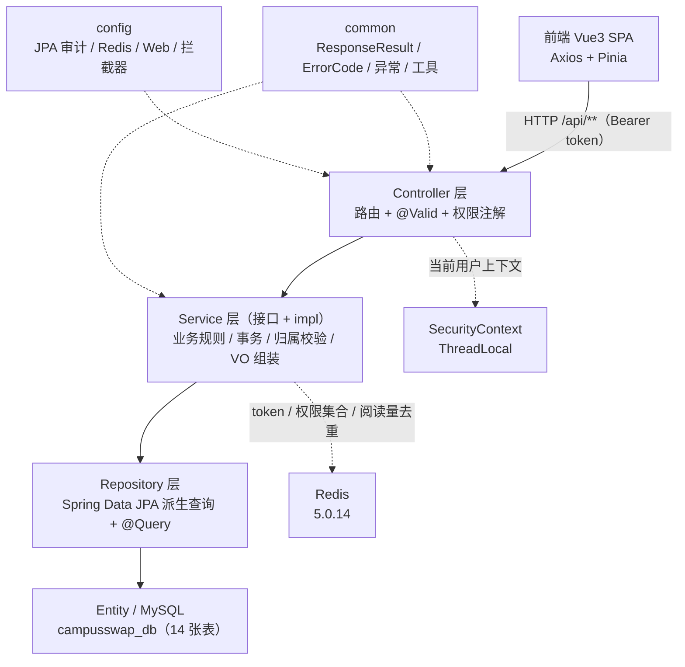
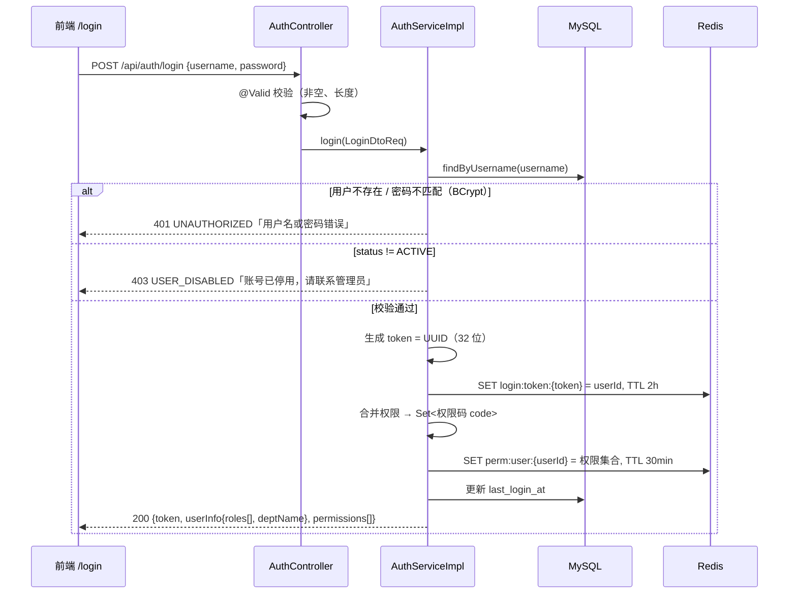
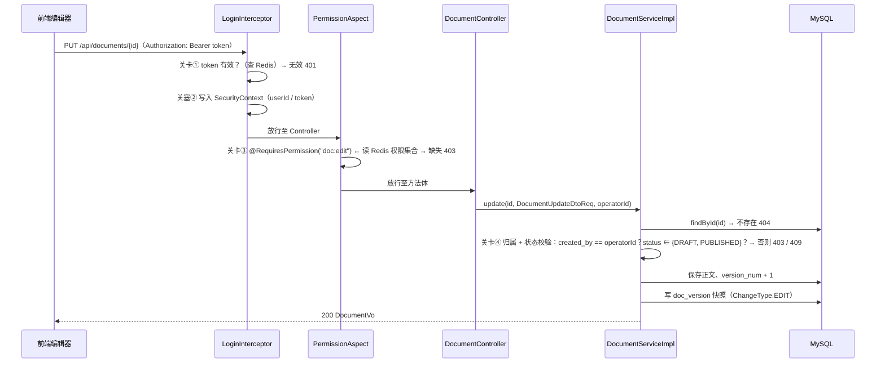
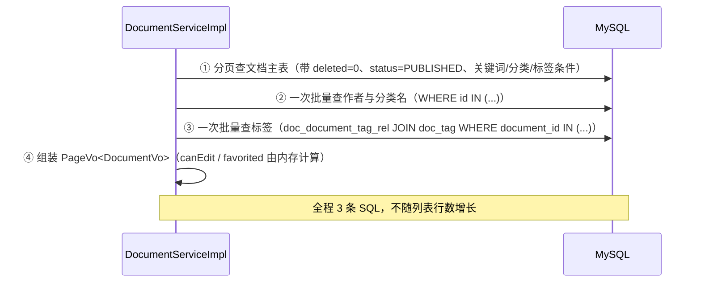
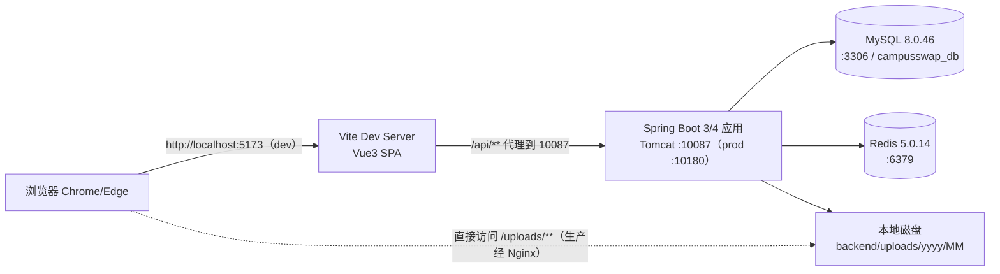

# CampusSwap 文档管理平台 · 系统架构设计（ARCHITECTURE）

| 项 | 值 |
|---|---|
| 文件 | `docs/02-design/ARCHITECTURE.md` |
| 版本 | v1.0（M1 产出） |
| 日期 | 2026-09-21 |
| 状态 | **Frozen（已冻结）** |
| 上游依据 | `docs/01-requirements/GLOSSARY.md` **v2.1**、`PRD.md`、`USER_STORIES.md`、老师课件《1.2 数据库物理建模》《2.1 JPA 专题指南》 |
| 下游消费 | M3 后端骨架（包结构、鉴权链路、统一响应）、M4 文档业务、`backend/sql/schema.sql` |

---

## 1. 架构目标与设计原则

| # | 目标 | 衡量方式 |
|---|---|---|
| G1 | 分层清晰：任何人拿到代码能在 3 分钟内定位"这个功能写在哪一层" | 包结构与依赖方向唯一（§3） |
| G2 | 鉴权与数据归属双重防护，越权一律 403 | `@RequiresPermission` + Service 归属校验（§5） |
| G3 | 契约稳定：前端只依赖 VO，字段名与 GLOSSARY 逐字一致 | API_SPECIFICATION + GLOSSARY 对齐检查（M1-T1.5） |
| G4 | 单机可跑、可提交、零魔法 | 一条命令启动，无外部中间件依赖（Redis 可降级） |
| G5 | 与老师课件规范同风格 | 主键自增、审计列、包结构、状态枚举字符串（GLOSSARY v2.1） |

**设计原则（冲突时的裁决顺序）**

1. **需求冻结文档 > 本文件 > 代码**：任何分歧以 `docs/01-requirements/` 为准。
2. **能不加就不加**：不引入消息队列、缓存框架、代码生成器、MapStruct、Swagger 注解（接口文档就是 `API_SPECIFICATION.md`）。
3. **约定优于配置**：命名、分层、异常、响应体全平台统一，不搞"局部特例"。
4. **业务规则写在 Service，不写在 Controller，不藏在 SQL**。
5. **老师课件的写法优先**：同一件事有多种写法时，与课件示例一致者胜。

---

## 2. 技术栈与版本（本机已就绪）

| 层 | 技术 | 版本 | 说明 |
|---|---|---|---|
| 运行环境 | JDK | **17.0.5**（编译目标 17） | `D:\DevEnv\02_JDK\jdk-17.0.5`（21.0.6 并存，构建固定 17） |
| 后端框架 | Spring Boot | 4.1.1 | web / data-jpa / validation / data-redis |
| 持久化 | Spring Data JPA + Hibernate | Boot 4.1.1 托管 | `ddl-auto: none`，表结构走 `schema.sql` |
| 数据库 | MySQL | 8.0.46（服务名 `MySQL80`） | 库 `campusswap_db`，InnoDB / utf8mb4 / utf8mb4_unicode_ci |
| 缓存 | Redis | 5.0.14（服务名 `Redis`，端口 6379） | token、权限集合、阅读量去重 |
| 工具库 | Lombok、Hutool | Boot 托管 / 5.8.47 | Hutool 仅用 `IdUtil`（备用）、`BCrypt`、`StrUtil` |
| 构建 | Maven Wrapper | `./mvnw` | 本地仓库 `D:\DevEnv\05_Maven\repository`，阿里云镜像 |
| 前端 | Vue 3 + TypeScript(strict) + Vite | 最新稳定 | Pinia / Vue Router / Axios / Tailwind CSS |
| Markdown | markdown-it + DOMPurify | 最新稳定 | 渲染 + XSS 清洗 |
| 后端端口 | dev `10087` / prod `10180` | — | 前端 Vite dev `5173`（均已实测空闲） |

---

## 3. 分层架构

### 3.1 分层与依赖方向



**允许的依赖**：`Controller → Service → Repository → Entity`；`任何层 → common / config`。
**禁止的依赖**：Repository 依赖 Service；Entity 出现在 Controller 入参或出参；Service 之间循环依赖；Controller 直接 new VO 之外的业务对象。

### 3.2 包结构（按业务模块分包 + entity 统一在外层，与课件《1.2》一致）

```
backend/src/main/java/com/campusswap
├── CampusSwapApplication.java
├── common/                       # 全平台共享，不含业务
│   ├── api/          ResponseResult.java · PageVo.java · ErrorCode.java
│   ├── exception/    BusinessException.java · GlobalExceptionHandler.java
│   ├── security/     RequiresPermission.java · PermissionAspect.java · SecurityContext.java · LoginInterceptor.java
│   └── util/         IdUtil? · FileNameUtil.java · MarkdownUtil.java
├── config/                       # Spring 配置
│   ├── JpaAuditConfig.java       # @EnableJpaAuditing + AuditorAware
│   ├── WebMvcConfig.java         # 拦截器注册 + 静态资源映射（/uploads/**）
│   ├── RedisConfig.java          # RedisTemplate<String,Object> 序列化
│   └── CorsConfig.java           # dev 跨域（5173 → 10087）
├── entity/                       # 所有实体与枚举（顶层集中，课件规范）
│   ├── BaseEntity.java · User.java · Dept.java · Role.java · Permission.java
│   ├── UserRole.java · UserPermission.java · RolePermission.java · DeptRole.java
│   ├── Document.java · DocumentVersion.java · Category.java · Tag.java
│   ├── DocumentTagRel.java · Favorite.java
│   └── enums/        DocumentStatus.java · UserStatus.java · PermType.java · RoleCode.java · ChangeType.java
├── system/                       # 模块一：系统与权限
│   ├── controller/   AuthController · UserController · RoleController · PermissionController · DeptController
│   ├── service/      接口 + impl（AuthServiceImpl …）
│   ├── repository/   UserRepository · RoleRepository · PermissionRepository · DeptRepository · 各关联表 Repository
│   ├── dto/          LoginDtoReq · UserCreateDtoReq · UserUpdateDtoReq · RoleDtoReq · PermissionDtoReq · DeptDtoReq …
│   └── vo/           LoginVo · UserInfoVo · UserVo · RoleVo · PermissionVo · DeptVo
└── document/                     # 模块二：文档业务
    ├── controller/   DocumentController · ReviewController · CategoryController · TagController · FileController · StatController
    ├── service/      接口 + impl
    ├── repository/   DocumentRepository · DocumentVersionRepository · CategoryRepository · TagRepository · DocumentTagRelRepository · FavoriteRepository
    ├── dto/          DocumentCreateDtoReq · DocumentUpdateDtoReq · DocumentQueryDtoReq · ReviewDtoReq · CategoryDtoReq · TagDtoReq
    └── vo/           DocumentVo · DocumentDetailVo · DocumentVersionVo · CategoryVo · TagVo · StatVo
```

**为什么按模块分包**：`system/` 与 `document/` 两块业务由两个里程碑（M3、M4）分头开发，按模块分包做到"改文档业务不会碰到系统权限代码"；`entity` 集中在顶层则让"表 ↔ 实体"一目了然（课件《1.2》§131 的原话就是这个理由）。

### 3.3 分层职责与红线

| 层 | 只做 | 绝不做 |
|---|---|---|
| Controller | 路由映射、`@Valid` 校验、取当前用户 ID、`@RequiresPermission` 标注、返回 `ResponseResult` | 写业务规则、直接调 Repository、拼 SQL、`try-catch` 吞异常 |
| Service | 业务规则（BR-xx）、事务、归属/状态校验、DTO→Entity、Entity→VO、缓存读写 | 出现 `EntityManager`/原生 SQL、返回 Entity、依赖 `HttpServletRequest` |
| Repository | `JpaRepository` 派生查询、`@Query`（JPQL）、分页 | 写业务判断、改状态、跨表更新 |
| Entity | 表映射、审计字段、`@SQLDelete`/`@SQLRestriction` | 承担业务方法、被序列化出接口 |
| DTO/VO | 入参校验注解 / 出参字段 | 混用（一个类既当入参又当出参） |

---

## 4. 关键请求流转

### 4.1 登录（US-01）



### 4.2 带鉴权的写操作（以 US-06 编辑文档为例，展示四道关卡）



### 4.3 列表查询（N+1 防护示例）



---

## 5. 鉴权链路（自定义注解 + AOP）

### 5.1 四道关卡（缺一不可）

| 关卡 | 位置 | 检查内容 | 失败返回 |
|---|---|---|---|
| ① 认证 | `LoginInterceptor`（`WebMvcConfig` 注册，排除 `/api/auth/login`、`/uploads/**`） | `Authorization: Bearer <token>` 是否在 Redis 中存在且未过期 | 401 `UNAUTHORIZED` |
| ② 上下文 | 同上 | 把 `userId` / `token` 放入 `SecurityContext`（`ThreadLocal`），请求结束 `finally` 清理 | — |
| ③ 功能权限 | `PermissionAspect`（`@Before` 切 `@RequiresPermission`） | 权限集合是否包含注解声明的权限码 `code` | 403 `NO_PERMISSION` |
| ④ 数据归属 | Service 方法内 | 资源存在性 + 归属（属主/管理员）+ 状态合法性 | 404 / 403 / 409 |

> **关卡④ 是防平行越权（IDOR）的唯一可靠位置**：前端隐藏按钮、URL 里猜 ID 都拦不住，只有 Service 层用"当前用户 ID vs 资源属主"判断才有效。

### 5.2 Token 方案：随机串 + Redis（**不用 JWT**）

| 维度 | 本方案 | 为什么不是 JWT |
|---|---|---|
| 形态 | `UUID` 去横线（32 位）随机串，Redis `login:token:{token} → userId` | JWT 自包含，签发后无法主动作废 |
| 有效期 | 2 小时（`BR-19`），每次请求不自动续期（简单可预期） | 续期逻辑容易写错 |
| 主动失效 | 登出、停用用户、重置密码 → 直接 `DEL` token | JWT 需额外维护黑名单，等于又用回 Redis |
| 取权限 | 再从 `perm:user:{userId}` 读权限集合 | JWT 塞权限会导致改权限后 token 内的权限过期不一致 |

### 5.3 代码骨架（M3 直接照抄）

```java
// common/security/RequiresPermission.java
@Target(ElementType.METHOD) @Retention(RetentionPolicy.RUNTIME)
public @interface RequiresPermission { String value(); }   // 如 @RequiresPermission("doc:publish")

// common/security/PermissionAspect.java
@Aspect @Component @RequiredArgsConstructor
public class PermissionAspect {
    private final PermissionCacheService permissionCacheService;

    @Before("@annotation(requiresPermission)")
    public void check(RequiresPermission requiresPermission) {
        Long userId = SecurityContext.currentUserId();
        if (!permissionCacheService.permissionsOf(userId).contains(requiresPermission.value())) {
            throw new BusinessException(ErrorCode.NO_PERMISSION);     // → 403
        }
    }
}

// Service 内的归属校验（每个写接口都要有）
private void assertOwnerOrAdmin(Document doc, Long operatorId) {
    boolean isOwner = doc.getCreatedBy().equals(operatorId);
    boolean isAdmin = permissionCacheService.permissionsOf(operatorId).contains("doc:manage");
    if (!isOwner && !isAdmin) { throw new BusinessException(ErrorCode.NO_PERMISSION); }
}
```

---

## 6. RBAC 权限合并算法

### 6.1 数据模型（GLOSSARY v2.1 §2.1）

```
sys_user ──dept_id──> sys_dept ──(sys_dept_role)──> sys_role ──(sys_role_permission)──> sys_permission
    └──(sys_user_role)──> sys_role
    └──(sys_user_permission)──────────────────────────────────────────────────────────> sys_permission
```

### 6.2 合并算法（登录与缓存未命中时执行）

```text
effectivePermissions(userId):
  1. user      = sys_user.findBy(id = userId)
  2. roleIds   = sys_user_role(user_id = userId)                    // 用户直授角色
               ∪ sys_dept_role(dept_id = user.dept_id)             // 部门继承角色
  3. permIds   = sys_role_permission(role_id ∈ roleIds)             // 角色带来的权限
               ∪ sys_user_permission(user_id = userId)             // 个别直授权限
  4. return Set<sys_permission.code where id ∈ permIds and deleted = 0>   // 去重后的权限码集合
```

**SQL（一条查询完成，避免多轮往返）**

```sql
SELECT DISTINCT p.code
FROM sys_permission p
WHERE p.deleted = 0 AND p.id IN (
    SELECT rp.permission_id FROM sys_role_permission rp
    WHERE rp.role_id IN (
        SELECT ur.role_id FROM sys_user_role ur WHERE ur.user_id = #{userId}
        UNION
        SELECT dr.role_id FROM sys_dept_role dr
        WHERE dr.dept_id = (SELECT u.dept_id FROM sys_user u WHERE u.id = #{userId})
    )
    UNION
    SELECT up.permission_id FROM sys_user_permission up WHERE up.user_id = #{userId}
);
```

### 6.3 缓存与失效（BR-18）

| 时机 | 动作 |
|---|---|
| 登录成功 | 计算并写 `perm:user:{userId}`，TTL 30 分钟 |
| 鉴权命中缓存 | 直接读 Redis，不查库 |
| 缓存未命中 | 查库计算 → 回写 Redis |
| **角色权限变更**（`PUT /api/roles/{id}/permissions`） | `DEL perm:user:{uid}`（该角色下所有用户） |
| **用户角色/直授权限变更** | `DEL perm:user:{uid}`（该用户） |
| **部门绑定角色变更** | `DEL perm:user:{uid}`（该部门所有用户） |
| 用户停用 / 重置密码 | `DEL perm:user:{uid}` + `DEL login:token:*`（该用户全部 token） |
| Redis 不可用 | 降级为每次直查数据库（功能不中断，只变慢），并在日志打 WARN |

---

## 7. Redis 键设计

| 键 | 类型 | TTL | 写入方 | 用途 | 失效时机 |
|---|---|---|---|---|---|
| `login:token:{token}` | String | 2 小时 | 登录 | token → userId，鉴权关卡① | 登出删除；停用/改密批量删除；到期自动过期 |
| `perm:user:{userId}` | Set | 30 分钟 | 登录 / 缓存未命中 | 权限码集合，鉴权关卡③ | 授权变更主动删（§6.3） |
| `view:doc:{docId}:{userId}` | String | 30 分钟 | 文档详情 | 阅读量去重（BR-09），`SETNX` 成功才 `view_count + 1` | 到期自动过期 |
| `user:tokens:{userId}` | Set | 2 小时 | 登录 | 该用户全部 token（用于一键下线） | 停用/改密时遍历 DEL |

**约定**：所有键必须带业务前缀（`login:` / `perm:` / `view:` / `user:`），禁止裸键名；值统一用字符串或集合，不存序列化 Java 对象（避免类变更导致反序列化炸）。

---

## 8. 事务边界

| 场景 | 事务策略 | 说明 |
|---|---|---|
| 查询类 Service 方法 | `@Transactional(readOnly = true)` | 类级默认，方法级覆盖 |
| 单表写入 | 类级 `@Transactional` | 默认 `REQUIRED` 传播 |
| **文档保存 + 版本快照**（T2/T4） | 一个事务 | 两表要么一起成功，要么一起回滚（§9 不变式） |
| **发布/归档/驳回**（状态流转 + 版本 + 审计） | 一个事务 | 状态与留痕必须原子 |
| **彻底删除**（T10） | 一个事务 | 主表 + `doc_version` + `doc_document_tag_rel` + `doc_favorite` 级联清理 |
| **角色授权覆盖式保存** | 一个事务 | 先 `deleteByRoleId` 再批量插入；事务提交后再删 Redis 缓存 |
| 文件上传 | **不开事务** | 磁盘 IO 不进事务；失败时手工清理已落盘文件 |
| Service 调 Service | 默认 `REQUIRED`（同一事务） | 禁 `REQUIRES_NEW`，避免嵌套事务锁等待 |

**事务内禁止**：发起 HTTP 请求、写文件、长循环、`Thread.sleep`、删 Redis（缓存删除放到事务提交之后，用 `TransactionSynchronizationManager` 或直接在 Controller 之后调用）。

---

## 9. 统一响应与全局异常

```java
// common/api/ResponseResult.java  —— 全平台唯一响应体
public record ResponseResult<T>(int code, String message, T data) {
    public static <T> ResponseResult<T> ok(T data) { return new ResponseResult<>(200, "操作成功", data); }
    public static <T> ResponseResult<T> ok()       { return new ResponseResult<>(200, "操作成功", null); }
    public static <T> ResponseResult<T> fail(ErrorCode ec) { return new ResponseResult<>(ec.getCode(), ec.getMessage(), null); }
    public static <T> ResponseResult<T> fail(ErrorCode ec, String message) { return new ResponseResult<>(ec.getCode(), message, null); }
}

// common/api/PageVo.java
public record PageVo<T>(List<T> list, long total, int pageNum, int pageSize) {
    public static <T> PageVo<T> of(Page<T> page) {
        return new PageVo<>(page.getContent(), page.getTotalElements(),
                            page.getNumber() + 1, page.getSize());
    }
}

// common/api/ErrorCode.java —— code 与 HTTP 状态码保持一致（GLOSSARY §4.2）
public enum ErrorCode {
    SUCCESS(200, "操作成功"),
    BAD_REQUEST(400, "参数校验失败"),
    UNAUTHORIZED(401, "登录状态已失效，请重新登录"),
    NO_PERMISSION(403, "无权限执行该操作"),
    USER_DISABLED(403, "账号已停用，请联系管理员"),
    NOT_FOUND(404, "请求的资源不存在"),
    CONFLICT_STATUS(409, "当前状态不允许该操作"),
    SERVER_ERROR(500, "服务器开小差了，请稍后重试");
}
```

### 9.1 全局异常处理表（`GlobalExceptionHandler`）

| 异常 | 返回 code | message 来源 |
|---|---|---|
| `BusinessException` | 携带的 `ErrorCode` | 异常自带（写死中文） |
| `MethodArgumentNotValidException`（`@Valid` 失败） | 400 | **DTO 注解里的 `message`**（中文，取第一条） |
| `ConstraintViolationException`（`@RequestParam` 校验） | 400 | 同上 |
| `MethodArgumentTypeMismatchException`（路径参数类型错） | 400 | 「参数格式不正确：{参数名}」 |
| `HttpMessageNotReadableException`（JSON 解析失败） | 400 | 「请求体格式不正确」 |
| `MaxUploadSizeExceededException` | 400 | 「图片大小不能超过 5MB」 |
| `NoResourceFoundException` / 404 | 404 | 「请求的资源不存在」 |
| `Exception`（兜底） | 500 | 「服务器开小差了，请稍后重试」+ **日志打完整堆栈**（响应体绝不暴露堆栈与 SQL） |

### 9.2 参数校验中文消息规范（老师红线 R3）

| 场景 | 注解写法 | 中文提示 |
|---|---|---|
| 必填 | `@NotBlank(message = "文档标题不能为空")` | 字段名 + 不能为空 |
| 长度 | `@Size(max = 128, message = "文档标题不能超过128字")` | 字段名 + 范围 |
| 分页下限 | `@Min(value = 1, message = "页码不能小于1")` | 字段名 + 边界 |
| 分页上限 | `@Max(value = 100, message = "每页条数不能超过100")` | 字段名 + 边界 |
| 枚举 | `@Pattern(regexp = "DRAFT|PUBLISHED|ARCHIVED|TRASH", message = "文档状态取值非法")` | 字段名 + 取值非法 |

---

## 10. 数据访问规约（JPA）

| # | 规约 | 说明 |
|---|---|---|
| 1 | 主键 `Long id` + `AUTO_INCREMENT`，**禁 `long`** | 包装类型避免 Hibernate 代理判空陷阱 |
| 2 | 实体禁 `@Data`（3.1 红线一） | `@Data` 的 `toString/equals/hashCode` 在双向关联上会递归到 `StackOverflowError`；用 `@Getter @Setter @ToString(callSuper = true) @NoArgsConstructor @AllArgsConstructor @Builder` |
| 3 | 所有业务实体继承 `BaseEntity`（`created_at/created_by/updated_at/updated_by/deleted` + 审计监听器） | 审计列由框架填，业务代码不手写 |
| 4 | `@SQLDelete(sql = "UPDATE 表 SET deleted = 1 WHERE id = ?")` + `@SQLRestriction("deleted = 0")` | 业务查询永不手写 `deleted = 0` |
| 5 | 枚举一律 `@Enumerated(EnumType.STRING)` | 禁 `ORDINAL`，避免枚举顺序变更后数据错位 |
| 6 | **关联映射遵循"写 ID、读关联"**（2.1 §4.2 决策树 + 3.1 §1） | 写入一律用字段 ID / 显式中间实体；查询导航用**只读**对象关联，见 §10.1 |
| 7 | 关联字段一律 `FetchType.LAZY`，**禁 `EAGER`**（3.1 §1.3、DoD） | `@ManyToOne` 默认是 EAGER，必须显式覆写；否则查一条连带一条 JOIN |
| 8 | 树形禁自关联对象（2.1 §4.5）：`parent_id` + `ancestors` | 杜绝递归 `toString` 与懒加载地狱 |
| 9 | 不建数据库外键 | 与老师 MySQL 示例一致（只有 `INDEX`，无 `FOREIGN KEY`），删除与迁移不被约束阻塞 |
| 10 | `ddl-auto: none` | 表结构只能来自 `sql/schema.sql` |
| 11 | 列表查询用 `Pageable`，禁止 `findAll()` 全表返回 | 配合 `BR-05` 分页上限 |
| 12 | **列表查询禁 N+1**（3.1 §2、红线二）：`@EntityGraph` / DTO 投影 / `JOIN FETCH`；禁止循环内调用 Repository | 详见 §10.2 选用表 |
| 13 | **列表禁查大文本**（3.1 红线三）：`DocumentVo` 不含 `contentMd`，列表走 DTO 投影 | 20 条 × 数万字正文 = 响应体 5MB，带宽与堆内存双爆 |
| 14 | 动态多条件查询用 `JpaSpecificationExecutor`（3.1 §3），禁手写 SQL 拼接 | 详见 §10.3 |
| 15 | 计数型更新（`view_count`/`favorite_count`）用 `@Modifying @Query` 原子自增 | 避免"读-改-写"丢失更新 |
| 16 | 参数类型必须与列类型一致（3.1 红线四） | `VARCHAR` 列传数字会触发隐式转换 → 索引失效 |
| 17 | 深分页保护（3.1 红线五） | `pageNum > 100` 拒绝（400）或改游标；禁止无限 `OFFSET` |

### 10.1 关联映射规范：写 ID、读关联（两份课件的分工）

```java
// ── 写模型：Service 写入时只用 ID / 显式中间实体 ─────────────────────────
document.setCategoryId(dto.categoryId());                 // 字段 ID 关联（2.1 §4.2 决策树）
documentTagRelRepository.deleteByDocumentId(docId);       // 标签用显式中间实体清空重插（2.1 §4.4）

// ── 读模型：查询导航用的只读对象关联（3.1 §1.1 / §1.2） ────────────────
@ManyToOne(fetch = FetchType.LAZY)                        // 绝不 EAGER
@JoinColumn(name = "category_id", insertable = false, updatable = false)   // 只读：写入不经过它
private Category category;

@ManyToMany(fetch = FetchType.LAZY)                       // 只读视图，禁止 add/remove
@JoinTable(name = "doc_document_tag_rel",
           joinColumns = @JoinColumn(name = "document_id"),
           inverseJoinColumns = @JoinColumn(name = "tag_id"))
private Set<Tag> tags = new HashSet<>();
```

| # | 纪律 | 理由 |
|---|---|---|
| A1 | 关联字段全部 `LAZY`，无裸露 `EAGER` | 3.1 §1.3：EAGER 是隐式连表风暴的源头 |
| A2 | `category` 用 `insertable = false, updatable = false`；写入只认 `categoryId` | 同一列不被两处映射争抢，写入行为可预期 |
| A3 | `tags` 集合**只读**：标签增删一律走 `DocumentTagRelRepository` | 2.1 §4.4：`@ManyToMany` 的差异比对会逐条 DELETE，且隐藏表挂不了 `created_at` |
| A4 | **反向集合不建**（不写 `Category.documents`、`Tag.documents`） | 单向即可满足查询；双向必带递归与 `@Data` 栈溢出风险 |
| A5 | `@ToString.Exclude` 标在关联字段上 | 打印日志时不触发懒加载 SQL |

> **为什么两者都要**：2.1 §4.2 决策树约束的是**写模型**（独立业务领域 → 字段 ID 关联；禁 `@ManyToMany` 是因为隐藏中间表无法挂审计字段、无法可控清空、误配级联会误删共享数据）；3.1 §1/§2 教的是**读模型**（对象关联 + LAZY + `@EntityGraph` 才能一条 SQL 抓完）。本平台把两者分工：**写 ID，读关联**。

### 10.2 N+1 三大解法选用表（3.1 §2）

| 场景 | 首选方案 | 理由 |
|---|---|---|
| **列表分页**（要作者名/分类名，不要正文） | **DTO 构造函数投影** | 3.1 §2.4：只查必要列，绕过实体状态机，内存占用降 80% |
| 需要实体对象做后续业务判断（详情、状态校验） | **`@EntityGraph(attributePaths = {...})`** | 3.1 §2.3 企业推荐：派生查询 + 分页都能用，底层自动 `LEFT JOIN` |
| 单条 / 少量固定关联的定制查询 | **`JOIN FETCH`**（JPQL） | 3.1 §2.2：一条 SQL 抓完，直观可控 |
| 按 N 个 ID 批量补名称（作者/部门） | `findAllById` + Map 分组 | 3.1 红线二：一条 `IN` 查询替代 N 条单查 |

**明令禁止**：循环内调用 Repository；`Page<Entity>` 配集合型 `JOIN FETCH`（Hibernate 会退化成内存分页并告警 `HHH000104`）。
**验收手段**：dev 环境开 `spring.jpa.show-sql`，任一列表接口的 SQL 条数**必须是常数**（≤ 3 条，且不随 `pageSize` 增长）；M6 测试留证。

### 10.3 动态多条件查询：`JpaSpecificationExecutor`（3.1 §3）

```java
public interface DocumentRepository extends JpaRepository<Document, Long>,
                                            JpaSpecificationExecutor<Document> { }
```

| 接口 | 动态条件 |
|---|---|
| `GET /api/documents`（检索） | 关键词 + 分类（含子孙）+ 标签 + 状态 + **时间区间** |
| `GET /api/review/documents`（审核队列） | 状态 + 关键词 + 时间区间 |
| `GET /api/users`（用户列表） | 关键词 + 部门 + 状态 |
| `GET /api/documents/mine`、`/trash` | 状态 + 关键词 + 时间区间 |

- 条件用 `criteriaBuilder.and(...)` 组合，空值自动跳过（**无 `1=1` 拼接、无字符串 SQL**）。
- 固定条件（按 ID 查详情、按用户名查用户）仍用派生查询，不要为动态而动态。

### 10.4 索引与执行计划（3.1 §4）

| 高频查询 | 目标索引 | 验证方式 |
|---|---|---|
| 分类 + 状态 + 更新时间倒序（检索主路径） | `idx_doc_cat_status_updated(category_id, status, updated_at, deleted)` | `EXPLAIN ANALYZE` 显示 `Index Scan`，无 `Rows Removed by Filter` |
| **仅状态 + 更新时间**（审核队列、我的文档） | `idx_doc_status_updated(status, updated_at, deleted)` | **最左前缀**：`status` 单独筛选走不了上一个索引，必须单独建 |
| 作者维度（我的文档） | `idx_doc_created_by(created_by, deleted)` | |
| 收藏列表 | 主键 `(user_id, document_id)` + `idx_fav_doc(document_id)` | |
| 登录名查用户 | `uk_sys_user_username(username)` | |

**流程要求**：M2 建表时索引一次到位；**M6 用 DBeaver 对 3 条高频 SQL 执行 `EXPLAIN ANALYZE`，把原始输出与结论写入 `docs/03-qa-review/EXPLAIN-NOTES.md`**（命中哪个索引、是否出现 `Seq Scan` / `Using filesort`、最左前缀是否被满足）。

---

## 11. 文件上传与静态资源

| 项 | 约定 |
|---|---|
| 接口 | `POST /api/upload/image`（multipart/form-data，字段名 `file`） |
| 校验 | 扩展名 ∈ {jpg, jpeg, png, webp, gif}；MIME 白名单；单文件 ≤ 5MB（`BR-15`） |
| 落盘 | `{项目根}/uploads/yyyy/MM/{uuid}.{ext}`，UUID 重命名防路径穿越与重名 |
| 入库 | 只存**相对 URL**：`/uploads/2026/09/9f8c....png`（换域名/端口不用洗数据） |
| 访问 | `WebMvcConfig#addResourceHandlers` 映射 `/uploads/**` → `file:uploads/`；生产可交 Nginx |
| Git | `backend/uploads/*` 全部忽略，仅保留 `backend/uploads/.gitkeep`（老师明确不提交 uploads） |
| 删除 | 文档彻底删除时**不**自动删图片（避免误删被其它文档引用的图），仅在文档中保留链接 |

---

## 12. 并发、幂等与一致性

| 场景 | 处理 | 理由 |
|---|---|---|
| 收藏 / 取消收藏 | 复合主键 `(user_id, document_id)` + 先查后插；重复收藏视为**幂等成功** | `BR-10` |
| 重复提交发布 | Service 先校验 `status == DRAFT`，否则 409 | 状态机 `T2` |
| 并发编辑同一文档 | 不做乐观锁（`@Version`）；以 `version_num` 单调递增 + 后写覆盖 | 单机课程项目，业务上"最后保存者生效"可接受，避免 `ObjectOptimisticLockingFailureException` 噪声 |
| 阅读量并发 | Redis `SETNX view:doc:{docId}:{userId}` 成功才 `UPDATE ... SET view_count = view_count + 1` | `BR-09` + 原子自增 |
| 权限缓存与授权变更 | 事务提交后再 `DEL` 缓存 | 避免"缓存已删、事务回滚"导致读到旧权限的窗口 |
| 分类删除 | 先校验无子分类且分类下无文档，再软删除 | `BR-13` |

---

## 13. 日志与可观测

| 项 | 约定 |
|---|---|
| 框架 | Logback（Boot 默认），输出到控制台 + `backend/logs/campusswap.log`（`logs/` 已 gitignore） |
| 级别 | 根 `INFO`；`com.campusswap` `DEBUG`（dev）；SQL 打印 `spring.jpa.show-sql: true` 仅 dev |
| 必打日志 | 登录成功/失败（含 username、IP，**不打密码**）、鉴权拒绝（userId + perm_code + 路径）、状态流转（docId + from → to + operatorId）、异常兜底 |
| 禁打日志 | 密码、token 全文、`password_hash`、数据库连接串密码 |
| 接口耗时 | `LoginInterceptor#afterCompletion` 记录 `method path status cost(ms)` 一行 |
| 审计留痕 | 业务写入靠 `created_by/updated_by`；文档变更靠 `doc_version`（谁、何时、改了什么） |

---

## 14. 配置与环境

| 文件 | 内容 |
|---|---|
| `application.yml` | 公共配置：`spring.profiles.active: dev`、Jackson 时区 `Asia/Shanghai`、`spring.servlet.multipart.max-file-size: 5MB`、`server.servlet.context-path: /` |
| `application-dev.yml` | `server.port: 10087`、数据源 `jdbc:mysql://localhost:3306/campusswap_db?...&serverTimezone=Asia/Shanghai&useSSL=false&allowPublicKeyRetrieval=true`、`username: root`、`password: ${DB_PASSWORD:123456}`、Redis `localhost:6379`、`ddl-auto: none`、`show-sql: true` |
| `application-prod.yml` | `server.port: 10180`、`show-sql: false`、日志级别 `INFO`、**密码必须来自环境变量**（无默认值） |

**安全约定（老师红线）**：仓库中任何位置不得出现生产明文密码；旧库 `docs_db` 时代的列名与连接串一律废弃，统一 `campusswap_db` 与新的审计列命名。

---

## 15. 部署视图（本机单实例）



| 组件 | 端口 | 启动方式 |
|---|---|---|
| MySQL80 | 3306 | Windows 服务（已设为自动启动） |
| Redis | 6379 | Windows 服务 |
| 后端 | 10087（dev）/ 10180（prod） | IDEA 运行 `CampusSwapApplication` 或 `./mvnw spring-boot:run` |
| 前端 | 5173（dev） | `pnpm dev`；`vite.config.ts` 里 `/api` 与 `/uploads` 代理到 10087 |

---

## 16. 功能价值说明（每个机制"多了什么用"）

| 模块 / 机制 | 解决什么问题 | 不做会怎样 | 溯源 |
|---|---|---|---|
| **三层 RBAC + 权限合并缓存** | 一次授权，全平台按钮与接口同时生效；新员工入职按部门自动继承权限 | 每加一个功能就要改代码判断角色；权限散落在 if-else 里无法维护 | US-08、BR-18 |
| **`@RequiresPermission` + AOP** | 鉴权与业务解耦，一行注解声明权限，Controller 里没有鉴权噪音 | 每个接口手写 `if (!hasPerm) throw`，漏一处就是越权漏洞 | PRD §3、老师红线 R4 |
| **Service 层归属校验（关卡④）** | 堵死平行越权：改 URL 里的 ID 也改不了别人的文档 | 前端隐藏按钮形同虚设，抓包即可改他人数据 | US-06 AC-06.2 |
| **统一 `ResponseResult` + 全局异常** | 前端只需一套拦截逻辑（`code !== 200` → 提示 message）；后端不写 try-catch 样板 | 每个接口返回结构不一，前端要写 N 套判断；500 堆栈直接暴露给用户 | NFR-M1、老师红线 R3 |
| **`@Valid` + 中文提示** | 参数错误在进入业务前被拦下，提示可直接展示给用户 | 校验逻辑散落 Service，前端要自己猜错误文案 | BR-04、AC-02.2 |
| **文档状态机（4 态 + 10 条边）** | 任何非法流转（如回收站里的文档直接发布）都被拒绝并回 409，数据不会进入"说不清的状态" | 状态字段变成"随便改"的字符串，回收站/归档语义崩塌 | US-03 AC-03.3、PRD §4 |
| **版本快照表 `doc_version`** | 每次改动留痕，支持版本对比与追责；驳回理由有地方落 | 改完就覆盖，出错无法回溯，也无法做审核记录 | US-07、F2-19 |
| **派生复用 `derived_from_id`** | 相似文档不用从零写，且保留血缘关系 | 用户复制粘贴，错漏无法溯源 | US-05、V1 价值 |
| **软删除 + `@SQLDelete/@SQLRestriction`** | 误删可从回收站恢复；业务查询自动过滤已删数据，不会漏写 `deleted = 0` | 物理删除不可逆；某处忘写过滤条件就查出"死数据" | BR-07、课件《2.1 专题指南》 |
| **Redis 权限缓存 + 主动失效** | 鉴权不用每次查三张表；授权变更立刻生效 | 每次请求查库（慢）；或缓存不失效（改了权限不生效，最危险） | BR-18 |
| **阅读量去重（`view:doc:{docId}:{userId}`）** | 同一用户 30 分钟内刷页面不重复计数，数据可信 | 刷新即 +1，阅读量失去参考价值 | BR-09 |
| **相对 URL 存图片** | 换端口/域名/部署机器不用洗数据 | 全库硬编码 `http://localhost:10087/...`，一换环境全挂 | BR-15 |
| **逗号 `ancestors` 祖先链** | 查"某目录下全部权限/分类"一条 SQL 搞定，层级加深不用改表 | 递归查询或层级写死（最多 3 层就无法扩展） | PRD §3.1、课件《1.2》 |
| **`ToStringSerializer` 统一字符串 ID** | 前端永远把 ID 当字符串，杜绝大整数精度丢失与类型摇摆 | 前端 `number` 存 ID，超过 2^53 后末位被抹平，详情页 404 | 课件《2.1 专题指南》§5.2 |

---

## 17. 架构决策记录（ADR）

| # | 决策 | 备选 | 结论与理由 |
|---|---|---|---|
| ADR-01 | 主键策略 | 雪花 ID / DB 自增 | **自增**：与老师 MySQL 示例一致；单机无分布式需求；`AUTO_INCREMENT` 让 `schema.sql` 可读性更好。前端仍统一字符串（预留切换空间） |
| ADR-02 | 审计列命名 | 旧前缀方案 / 统一 `created_*` `updated_*` | **`created_at/created_by/updated_at/updated_by/deleted`**：逐字对齐老师示例 |
| ADR-03 | 逻辑删除实现 | 手写 `WHERE deleted = 0` / `@SQLRestriction` | **注解**：一处声明全局生效，业务代码零负担（课件《2.1》明确收益） |
| ADR-04 | 认证方案 | JWT / 随机 token + Redis | **随机 token**：可主动失效（登出、停用、改密），实现更短更可控 |
| ADR-05 | 权限模型 | 仅角色 / 角色 + 部门 + 直授 | **三者合并**：覆盖"岗位继承"与"个别补权"两个真实场景，且课件表清单含 `sys_user_permission` |
| ADR-06 | 中间表形态 | 各带自增 `id` / 复合主键 | **复合主键**：天然去重，少一列少一个索引，与课件示例一致 |
| ADR-07 | 并发控制 | `@Version` 乐观锁 / 状态机 + 后写覆盖 | **不做乐观锁**：单机课程项目，`version_num` 已能表达业务版本；乐观锁会给前端增加 `409` 噪声 |
| ADR-08 | 接口文档 | Swagger/OpenAPI 注解 / Markdown 契约 + Apifox | **Markdown + Apifox**：契约先于代码（M1 产出），不被注解牵着走 |
| ADR-09 | 表结构管理 | `ddl-auto: update` / `schema.sql` | **`schema.sql`**：结构可评审、可版本化，老师红线明确禁止 `update` |
| ADR-10 | 数据库名 | `docs_db`（旧计划）/ `campusswap_db` | **`campusswap_db`**：按老师"项目名_db"约定（如 `dochub_db`），并与练习项目的 `docs_db` 隔离 |

---

## 18. 关键风险与对策

| 风险 | 影响 | 对策 |
|---|---|---|
| Redis 未启动或挂掉 | 登录与鉴权全挂 | 启动脚本 `start-all.cmd` 先起服务；权限读取失败降级查库；开发期先跑通再谈缓存 |
| 前端 ID 当 `number` 用 | 详情页 404、编辑串数据 | 后端统一 `ToStringSerializer`；前端 `types/` 里 ID 一律 `string`；M5 走查 |
| 忘记写归属校验 | 越权漏洞（评分重灾区） | Service 写接口模板固定含 `assertOwnerOrAdmin`；M6 测试用例覆盖 AC-06.2 |
| 列表接口 N+1 | 1 万文档时列表变慢 | §4.3 的"3 条 SQL"模式；M6 用日志数 SQL 条数 |
| 文档与代码字段漂移 | 前后端字段对不上，联调返工 | 唯一真源 GLOSSARY v2.1；M1-T1.5 机检 + M5/M6 走查 |
| 手滑提交产物 | 老师明确扣分项 | `backend/.gitignore` + `frontend/.gitignore`；提交前 `git ls-files` 自检（GIT-CHEATSHEET §2） |

---

## 19. 冻结自检

| 自查项 | 结论 | 证据 |
|---|---|---|
| 分层与依赖方向唯一、包结构含模块划分 | ✅ | §3.1 / §3.2 |
| 四道鉴权关卡齐备，防 IDOR 有固定落点 | ✅ | §5.1 / §5.3 |
| RBAC 合并算法与缓存失效时机完整 | ✅ | §6.2 / §6.3 |
| Redis 键有前缀、TTL、写入方、失效时机 | ✅ | §7 |
| 事务边界覆盖所有写场景，含禁止清单 | ✅ | §8 |
| 统一响应/异常/错误码与 GLOSSARY v2.1 一致 | ✅ | §9 / GLOSSARY §4.2 |
| JPA 规约与老师七戒律一致 | ✅ | §10 |
| 每个机制都说明了"解决什么问题、不做会怎样" | ✅ | §16 |
| 与课件示例的口径差异均有 ADR 记录 | ✅ | §17 |

---

**冻结签署**：本文件自 2026-09-21 起冻结；变更须在 `docs/03-qa-review/` 留痕并在 §17 追加 ADR。
