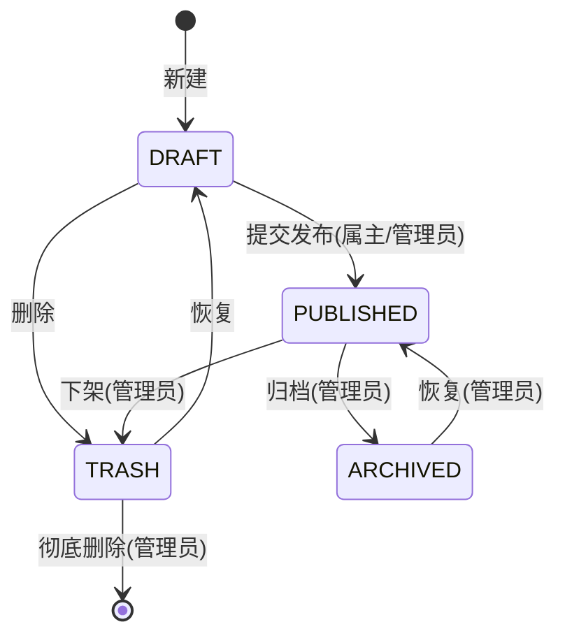

# CampusSwap 文档管理平台 · 大作业执行手册

**版本 v2.0（已冻结）**　·　更新：2026-09-21　·　维护：本项目开发者

> **这份文件是唯一权威口径。**
> 1. 本文件里没有出现的东西，一律不做；出现的东西，按它执行。
> 2. 与任何其它说法冲突时，以本文件为准。
> 3. 读者可以是人，也可以是 AI Agent：读完本文件 → 读 `docs/01-requirements/` → 直接从 §7 的任务看板开工。
> 4. 老师已确认的口径（2026-09-21）：**方案不必卡太死**、**根目录只放 `docs/ backend/ frontend/`**、**Redis 用本机自带的**、**做完必须上传 GitHub 且不提交产物目录**、**只按源码评分**。

---

## 0. 一分钟了解项目

| 项 | 内容 |
|---|---|
| **做什么** | 单位内部 **Markdown 文档管理平台**（品牌名 CampusSwap）：撰写、分类、检索、**派生复用**、版本管理、审核归档，全程 RBAC 控权 |
| **两大模块** | ① **系统与权限管理**（用户/角色/权限/部门 + 3 张授权中间表 + 部门-角色表 = 8 张表）<br>② **文档业务管理**（文档/分类/标签/版本/收藏/阅读记录 = 6 张表） |
| **三个角色** | `STAFF` 普通员工（写与读自己的）｜`DOC_ADMIN` 文档管理员（审核/分类/标签/全量文档）｜`SYS_ADMIN` 系统管理员（用户/角色/权限/部门） |
| **技术栈** | 前端 Vue 3 + TypeScript(strict) + Vite + Tailwind CSS + Pinia + Axios；后端 Java 17 + Spring Boot 4.1+ + Spring Data JPA(Hibernate 6) + Jakarta Validation + Lombok + Hutool；MySQL 8（InnoDB / utf8mb4_unicode_ci）；Redis 5.0.14（本机）；Nginx（仅部署可选） |
| **交付物** | 根目录三个文件夹 `docs/ backend/ frontend/` + **GitHub 仓库地址** |
| **评分口径** | **只看源码**：规范对齐、注释齐全、分层清晰、SQL 效率、红线零违反 |
| **总工期参考** | 10~14 个工作日（M0~M7，见 §7） |
| **唯一数据源** | `docs/01-requirements/GLOSSARY.md`（字段命名）+ `sql/schema.sql`（表结构），二者与代码必须字字一致 |

---

## 1. 已冻结决策（不再讨论）

| # | 决策 | 结论 | 依据 |
|---|---|---|---|
| 1 | 业务定位 | 单位内部 Markdown 文档管理平台 | 已确认 |
| 2 | 前端 | **必须自己做**，按 §6 规范实现全部页面 | 老师明确 |
| 3 | 权限表层级 | **3 层**：① 目录/模块 ② 菜单/页面 ③ 按钮/操作点；落库用 `parent_id + ancestors`，加层不必改表 | 老师授权自定 |
| 4 | Redis | **用本机 Redis 5.0.14**，三处用途：登录 Token/会话、权限合并结果缓存、文档阅读量计数 | 老师明确"用你自己的先" |
| 5 | 交付目录 | 根目录**只放** `docs/ backend/ frontend/`；收纳规则见 §3.2 | 老师明确 |
| 6 | 交付方式 | **必须上传 GitHub**（建议 Private）；后端不提交 `logs/ target/ uploads/`，前端不提交 `dist/ node_modules/` | 老师明确（附目录图） |
| 7 | 图片上传 | **支持**：Markdown 内嵌图片，单图 ≤5MB，落盘 `backend/uploads/`，**不入 Git**（老师 backend 有 `uploads/` 目录） | 由老师目录结构反推确认 |
| 8 | 包管理器 | **前端统一用 pnpm**（与 `AGENTS.md` 的 `pnpm run typecheck/lint` 一致），仓库里只保留 `pnpm-lock.yaml` | 二选一决断 |
| 9 | 构建命令 | 后端用 `./mvnw`（Maven Wrapper，与老师工程一致）；wrapper 下载慢时改 `distributionUrl` 为阿里云镜像 | 老师工程结构 |
| 10 | 金额 | 一律整数分 `price_cents INT UNSIGNED` / `priceCents`；**不做真实支付结算**，`price_cents` 只表示"0=免费，>0=需积分兑阅" | 老师红线 + 课件 |
| 11 | 检索方案 | MySQL `LIKE` / FULLTEXT + 索引，**不引入 Elasticsearch** | MVP 边界 |
| 12 | 数据库 | 库名 **`campusswap_db`**（按老师「项目名_db」约定，与练习项目的 `docs_db` 隔离）；表前缀 `sys_`（系统域）/ `doc_`（文档域）；应用账号 `campusswap_dev`（最小权限，不用 root） | 2026-09-21 对齐课件时变更 |
| 13 | Java 版本 | **编译目标 17**；可用 Record/Stream 等现代写法，不依赖 21 独有语法 | 老师工程实际配置 |
| 14 | 演示范畴 | 老师不看效果演示 → **不写演示脚本**，把精力投入源码与测试 | 老师明确 |

---

## 2. 硬约束（违反即扣分，逐条可检查）

> **决策状态（2026-09-21 用户指示）**：原本列出的"待老师确认的 10 个问题"**已全部关闭** —— 老师已确认的（用默认方案、根目录只 `docs/ backend/ frontend/`、Redis 用本机、必须上传 GitHub、评分只看源码）按确认结果执行，**其余一律按本手册的默认方案锁定，不再等待回复**。任何后续变更走 `docs/03-qa-review/` 留痕。

### 2.1 编码六红线（来自老师《AGENTS.md》）

| # | 红线 | 检查方式 |
|---|---|---|
| R1 | 字段不得脑补：Entity / DTO / VO / TS Interface / DB 列名 五处必须与 `GLOSSARY.md` + `schema.sql` 完全一致 | 交叉 grep 比对 |
| R2 | 金额禁止浮点：全链路 `priceCents` / `price_cents`（整数分），前端仅展示时 `/100` | `grep -ri "double\|float" **/Price*` 应为空 |
| R3 | Controller 入参必须 `@Valid` + Jakarta Validation 注解 + **中文错误提示** | 检查每个 `@RequestBody` |
| R4 | **禁止越权（IDOR）**：更新/下架/删除/派生必须在 Service 层校验属主（`createdBy == currentUserId` 或有管理权限） | 越权用例必须返回 403 |
| R5 | **禁止 Entity 穿透前端**：Controller 出参必须是 VO（脱敏），实体不出 Service | 检查返回类型 |
| R6 | 前端禁止内联 `style="..."`（用 Tailwind 原子类）；TypeScript **禁止 `any`** | `pnpm run lint` + `grep -rn "any" src/types` |

### 2.2 DDL 六条（来自老师建表提示词）

1. 每张表显式写 `ENGINE=InnoDB DEFAULT CHARSET=utf8mb4 COLLATE=utf8mb4_unicode_ci`
2. 金额列 `INT UNSIGNED`（分）
3. 主键 `BIGINT NOT NULL AUTO_INCREMENT`（**对齐老师《1.2 示例-数据库物理建表脚本(MySQL版)》**，2026-09-21 由"雪花禁用自增"变更而来；**6 张纯关联中间表用复合主键、无 `id` 列**）
4. **不建任何外键约束**（关联靠逻辑外键 + 代码校验）
5. 高频查询列建索引/复合索引，注意最左前缀
6. **每张表、每个字段都要有 `COMMENT`**

### 2.3 分层五条 + 注释规范

| 层 | 只做这些 | 绝不做 |
|---|---|---|
| Controller | 路由、`@Valid` 校验转发、调 Service、包装统一响应 | 业务逻辑、直接调 Repository |
| Service | 业务规则、事务（`@Transactional`）、属主校验、DTO↔Entity↔VO 转换 | 写原生 SQL、返回实体给 Controller |
| ServiceImpl | 实现 Service 接口（接口/实现分离） | — |
| Repository | Spring Data JPA 接口、`@Query`、投影查询 | 业务判断 |
| Entity / DTO / VO | 见 §5 | DTO 复用 Entity；VO 带敏感字段（如 `password_hash`） |

**注释（必须）**：每个类写类注释并含 `@author`；每个 public 方法写 `@param` / `@return`；复杂业务规则写行内说明。

### 2.4 前端四条

1. 目录固定：`src/{api,types,components,views,stores,router,utils}`
2. 类型对齐：`src/types` 的 Interface 与 `GLOSSARY.md` 一致；**所有雪花 ID 声明为 `string`**（防 JS 精度丢失）
3. Axios 统一封装：请求拦截带 Token；响应拦截统一处理 401（跳登录）/403（提示无权限）/业务错误码
4. 每页必须有四种状态：空、加载中、错误、无权限

---

## 3. 交付物与目录（最终形态）

### 3.1 最终目录树

```text
campusswap/                        ← 交付根目录（只有三个文件夹）
├── docs/                          📋 全部文档
│   ├── 01-requirements/           #  USER_STORIES.md · PRD.md · GLOSSARY.md
│   ├── 02-design/                 #  ARCHITECTURE.md · API_SPECIFICATION.md · UI_UX_SPECIFICATION.md · apifox-export/
│   ├── 03-qa-review/              #  tasks.md · TEST_CHECKLIST.md · CODE_REVIEW.md
│   └── 04-prompts/                #  P1~P7 阶段指令卡片（留档，可复现）
├── backend/                       ☕ Spring Boot 4.1 工程（包名 com.campusswap）
│   ├── .mvn/  mvnw  mvnw.cmd       #  Maven Wrapper（验收命令用 ./mvnw）
│   ├── .gitignore                 #  已就绪：忽略 target/ logs/ uploads/ 等
│   ├── sql/schema.sql             #  物理 DDL（从 sql/ 复制而来，满足三文件夹约束）
│   ├── uploads/                   #  运行期图片目录（.gitkeep 占位，不入 Git）
│   └── src/main/java/com/campusswap/
│       ├── common/                #  api/{ResponseResult,PageVo,ErrorCode} · exception/ · security/{@RequiresPermission,PermissionAspect,SecurityContext,LoginInterceptor} · util/
│       ├── config/                #  JpaAuditConfig · WebMvcConfig · RedisConfig · CorsConfig
│       ├── entity/                #  BaseEntity + 14 个实体 + enums/（顶层集中，与课件《1.2》一致）
│       ├── system/                #  模块一：系统与权限
│       │   ├── controller/        #    AuthController · UserController · RoleController · PermissionController · DeptController
│       │   ├── service/ + service/impl/
│       │   ├── repository/
│       │   ├── dto/               #    LoginDtoReq · UserCreateDtoReq · RoleDtoReq · PermissionDtoReq · DeptDtoReq …
│       │   └── vo/                #    LoginVo · UserInfoVo · UserVo · RoleVo · PermissionVo · DeptVo
│       └── document/              #  模块二：文档业务
│           ├── controller/        #    DocumentController · ReviewController · CategoryController · TagController · FileController · StatController
│           ├── service/ + service/impl/
│           ├── repository/
│           ├── dto/               #    DocumentCreateDtoReq · DocumentQueryDtoReq · ReviewDtoReq …
│           └── vo/                #    DocumentVo · DocumentDetailVo · DocumentVersionVo · CategoryVo · TagVo · StatVo
└── frontend/                      💻 Vue 3 + TS 工程
    ├── .gitignore                 #  已就绪：忽略 node_modules/ dist/ 等
    ├── src/{api,types,components,views,stores,router,utils}
    └── package.json · vite.config.ts · tailwind.config.js · tsconfig.json
```

### 3.2 收纳规则（把规范产物塞进三个文件夹）

| 原始位置 | 最终位置 | 命令 |
|---|---|---|
| `sql/schema.sql` | `backend/sql/schema.sql` | `mkdir -p backend/sql && cp sql/schema.sql backend/sql/` |
| `prompts/` | `docs/04-prompts/` | `cp -r prompts docs/04-prompts` |
| `tasks.md` | `docs/03-qa-review/tasks.md` | `mv tasks.md docs/03-qa-review/` |
| `tests/` | `backend/src/test/`（JUnit） | 直接写在工程内 |
| `uploads/` | `backend/uploads/`（不入 Git） | `.gitkeep` 占位 |
| `deploy/` | `backend/deploy/nginx.conf`（可选） | 有则附，无则不做 |

---

## 4. 数据模型（14 张表 · 权威字段表）

### 4.1 公共字段（所有业务表都有）

| 列名 | 类型 | 约束（逐字对齐老师 MySQL 示例） | 注释 |
|---|---|---|---|
| `id` | `BIGINT` | `NOT NULL AUTO_INCREMENT`，`PRIMARY KEY` | 唯一自增主键 |
| `created_at` | `DATETIME` | `NOT NULL DEFAULT CURRENT_TIMESTAMP` | 记录创建时间 |
| `created_by` | `BIGINT` | `NOT NULL DEFAULT 0`（0=系统初始化） | 创建人用户ID |
| `updated_at` | `DATETIME` | `NOT NULL DEFAULT CURRENT_TIMESTAMP ON UPDATE CURRENT_TIMESTAMP` | 最后更新时间 |
| `updated_by` | `BIGINT` | `NOT NULL DEFAULT 0` | 最后修改人用户ID |
| `deleted` | `TINYINT` | `NOT NULL DEFAULT 0` | 软删除标记：0 正常 / 1 已删除 |

> **例外（纯关联中间表）**：`sys_user_role`、`sys_user_permission`、`sys_role_permission`、`sys_dept_role`、`doc_document_tag_rel`、`doc_favorite` **没有 `id` 列**，采用复合主键，仅保留 `created_at`，不继承 `BaseEntity`。
> **实体侧**：`BaseEntity` + `@EntityListeners(AuditingEntityListener.class)`；每个实体加 `@SQLDelete(sql = "UPDATE 表名 SET deleted = 1 WHERE id = ?")` + `@SQLRestriction("deleted = 0")`，业务查询**永不手写** `deleted = 0`。

### 4.2 系统域（8 张表）

| 表名 | 关键列（除公共字段外） | 索引 |
|---|---|---|
| `sys_dept` | `name` VARCHAR(64)、`parent_id` BIGINT DEFAULT 0、`ancestors` VARCHAR(500)、`sort_order` INT DEFAULT 0 | `idx_sys_dept_parent(parent_id, deleted)` |
| `sys_user` | `username` VARCHAR(64)、`password_hash` VARCHAR(128)、`real_name` VARCHAR(64)、`email` VARCHAR(128)、`phone` VARCHAR(20)、`avatar_url` VARCHAR(255)、`dept_id` BIGINT、`status` VARCHAR(32) DEFAULT 'ACTIVE'（ACTIVE/LOCKED/DISABLED）、`last_login_at` DATETIME | `uk_sys_user_username(username)`、`idx_sys_user_dept(dept_id, deleted)` |
| `sys_role` | `name` VARCHAR(64)、`code` VARCHAR(64)（STAFF/DOC_ADMIN/SYS_ADMIN 或自定义）、`description` VARCHAR(255)、`is_builtin` TINYINT DEFAULT 0、`sort_order` INT | `uk_sys_role_code(code)` |
| `sys_permission` | `name` VARCHAR(64)、`code` VARCHAR(64)（如 `doc:publish`）、`type` VARCHAR(32)（DIR/MENU/BUTTON）、`parent_id` BIGINT DEFAULT 0、`ancestors` VARCHAR(500)、`path` VARCHAR(255)、`icon` VARCHAR(64)、`sort_order` INT | `uk_sys_permission_code(code)`、`idx_sys_perm_parent(parent_id, deleted)` |
| `sys_user_role` | `user_id`、`role_id`（**复合主键**） | `idx_user_role_role(role_id)` |
| `sys_user_permission` | `user_id`、`permission_id`（**复合主键**） | `idx_user_perm_perm(permission_id)` |
| `sys_role_permission` | `role_id`、`permission_id`（**复合主键**） | `idx_role_perm_perm(permission_id)` |
| `sys_dept_role` | `dept_id`、`role_id`（**复合主键**） | `idx_dept_role_role(role_id)` |

**权限 3 层落库示例**（`parent_id` + `ancestors`）：

```sql
-- ① 目录/模块层（type = DIR）
(1, 0, '0',        '文档中心',  'doc:center', 'DIR'),
(2, 0, '0',        '系统管理',  'sys:center', 'DIR'),
-- ② 菜单/页面层（type = MENU，父=1 或 2）
(10, 1, '0,1',     '我的文档',  'doc:mine',   'MENU'),
(11, 1, '0,1',     '文档检索',  'doc:search', 'MENU'),
(20, 2, '0,2',     '用户管理',  'sys:user',   'MENU'),
-- ③ 按钮/操作点层（type = BUTTON，父=10 等）
(100, 10, '0,1,10', '新建文档', 'doc:create', 'BUTTON'),
(101, 10, '0,1,10', '发布文档', 'doc:publish','BUTTON'),
(102, 10, '0,1,10', '删除文档', 'doc:delete', 'BUTTON');
```
> 查"文档中心下全部权限"：`WHERE ancestors LIKE '0,1%'`（0 递归）；再加第 4 层无需改表。

### 4.3 文档域（6 张表）

| 表名 | 关键列 | 索引 |
|---|---|---|
| `doc_document` | `title` VARCHAR(128)、`summary` VARCHAR(255)、`content_md` MEDIUMTEXT、`category_id` BIGINT DEFAULT 0、`status` VARCHAR(32) DEFAULT 'DRAFT'（DRAFT/PUBLISHED/ARCHIVED/TRASH）、`version_num` INT DEFAULT 1、`price_cents` INT UNSIGNED DEFAULT 0、`view_count` INT DEFAULT 0、`favorite_count` INT DEFAULT 0、`derived_from_id` BIGINT NULL、`reject_reason` VARCHAR(255)、`publish_at` DATETIME NULL（**作者 = `created_by`**） | `idx_doc_cat_status_updated(category_id, status, updated_at, deleted)`、`idx_doc_created_by(created_by, deleted)` |
| `doc_category` | `name` VARCHAR(64)、`parent_id` BIGINT DEFAULT 0、`ancestors` VARCHAR(500)、`sort_order` INT DEFAULT 0 | `idx_doc_category_parent(parent_id, deleted)` |
| `doc_tag` | `name` VARCHAR(64) 唯一、`use_count` INT DEFAULT 0 | `uk_doc_tag_name(name)` |
| `doc_document_tag_rel` | `document_id`、`tag_id`（**复合主键**） | `idx_rel_tag_doc(tag_id, document_id)` |
| `doc_version` | `document_id`、`version_num` INT、`title` VARCHAR(128)、`content_md` MEDIUMTEXT、`change_type` VARCHAR(32)、`change_remark` VARCHAR(255)、`created_by`（= 操作人） | `uk_doc_version(document_id, version_num)` |
| `doc_favorite` | `user_id`、`document_id`（**复合主键**） | `idx_fav_doc(document_id)` |

### 4.4 权限合并算法（Service 层实现，结果缓存进 Redis）

```text
effectivePermissions(userId):
  roles     = sys_user_role(user_id = userId) ∪ sys_dept_role(dept_id = 所属部门)
  fromRoles = ⋃ sys_role_permission(role_id ∈ roles)
  direct    = sys_user_permission(user_id = userId)
  return dedupe(fromRoles ∪ direct)          // Set<String> sys_permission.code
```
- 缓存键：`perm:user:{userId}`，TTL 30 分钟；
- **失效时机**：给用户/角色/部门增删授权、改动角色权限、停用用户时主动 `DEL`；
- 鉴权入口：自定义注解 `@RequiresPermission("doc:publish")` + AOP 切面校验（见 §5.5）。

### 4.5 文档状态机（写进 PRD，代码里用枚举实现）


规则：`TRASH` 可恢复（不能是死胡同）；只有 `DRAFT` 可编辑；`PUBLISHED` 修改后版本号 +1。

---

## 5. 实体与后端实现规约

### 5.1 JPA 实体七戒律（来自课件 2.1，逐条自查）

| # | 戒律 | 正确写法 |
|---|---|---|
| 1 | 禁 `@Data` | `@Getter @Setter @ToString(callSuper=true) @NoArgsConstructor @AllArgsConstructor @Builder` |
| 2 | 必须无参构造 | 同上（Hibernate 代理需要） |
| 3 | 主键用包装类 `Long` | `private Long id;`（禁 `long`） |
| 4 | 禁 `ddl-auto=update` | `spring.jpa.hibernate.ddl-auto=none`，表结构走 `schema.sql` |
| 5 | **禁 `@ManyToMany` 参与写入**（课件 2.1 §4.4） | 中间表建**显式实体**（`UserRole` / `RolePermission` / `DocumentTagRel`），挂 `created_at`，可整表清空重插；查询导航可用**只读** `@ManyToMany`（课件 3.1 §1.2），但禁止 `add/remove` |
| 6 | 禁自关联对象 | 树形用 `parentId` + `ancestors` 字段 |
| 7 | 所有 ID 序列化为 String | `@JsonSerialize(using = ToStringSerializer.class)`（主键 `BIGINT AUTO_INCREMENT`，Java 侧包装类 `Long`） |

**配套写法**：
```java
@Entity
@Table(name = "doc_document",
       indexes = { @Index(name="idx_doc_status", columnList="status"),
                   @Index(name="idx_doc_category", columnList="category_id") },
       comment = "文档主表")
@SQLDelete(sql = "UPDATE doc_document SET deleted = 1 WHERE id = ?")
@SQLRestriction("deleted = 0")
public class Document extends BaseEntity { … }
```
- 大文本：`@Lob @Column(name="content_md", columnDefinition="MEDIUMTEXT COMMENT 'Markdown 正文'")`
- 枚举：`@Enumerated(EnumType.STRING)`（禁 ORDINAL）
- 创建人/创建时间：`@Column(updatable = false)`
- 审计自动填充：`BaseEntity` 加 `@EntityListeners(AuditingEntityListener.class)` + `@CreatedBy/@CreatedDate/@LastModifiedBy/@LastModifiedDate`，配置类开 `@EnableJpaAuditing`

### 5.1.1 关联映射与查询性能（课件 3.1，**M3/M4 逐条验收**）

**核心口径：写 ID、读关联**（两份课件的分工，详见 `docs/02-design/ARCHITECTURE.md` §10.1）

```java
// 写模型（Service 写入）：只认 ID / 显式中间实体
document.setCategoryId(dto.categoryId());
documentTagRelRepository.deleteByDocumentId(docId);   // 标签清空重插

// 读模型（查询导航）：只读对象关联，一律 LAZY
@ManyToOne(fetch = FetchType.LAZY)
@JoinColumn(name = "category_id", insertable = false, updatable = false)
private Category category;

@ManyToMany(fetch = FetchType.LAZY)          // 只读视图，禁止 add/remove
@JoinTable(name = "doc_document_tag_rel",
           joinColumns = @JoinColumn(name = "document_id"),
           inverseJoinColumns = @JoinColumn(name = "tag_id"))
private Set<Tag> tags = new HashSet<>();
```

| # | 要求 | 验收证据 |
|---|---|---|
| P1 | 关联全部 `FetchType.LAZY`，无裸露 `EAGER` | 全仓 grep `EAGER` = 0；`@ManyToOne` 处均显式写 LAZY |
| P2 | **列表接口零 N+1**：优先 **DTO 构造函数投影**，需实体时用 **`@EntityGraph`**，少量定制用 `JOIN FETCH` | dev 开 `show-sql`，列表接口 SQL 条数**为常数（≤3 条）且不随 `pageSize` 增长**；M6 测试留证 |
| P3 | **列表禁查大文本**：`DocumentVo` 不含 `contentMd` | 接口出参字段核对（GLOSSARY §3.7） |
| P4 | 动态多条件用 **`JpaSpecificationExecutor` + Criteria**（分类/状态/关键词/时间区间自由组合），禁手写 SQL 拼接 | 组合条件测试用例（课件 3.1 实践任务 4） |
| P5 | 高频查询命中复合索引：`idx_doc_cat_status_updated(category_id,status,updated_at,deleted)`、`idx_doc_status_updated(status,updated_at,deleted)`（**最左前缀**：仅 status 筛选走不了前者）、`idx_doc_created_by_updated(created_by,updated_at,deleted)`（**排序键必须进索引**） | DBeaver `EXPLAIN ANALYZE` 输出 + `docs/03-qa-review/EXPLAIN-NOTES.md` 留档（M2 首测已产出：Q1 0.149ms / Q2 0.221ms / Q3 修复后 0.135ms / 对照组全表扫描 18.2ms） |
| P6 | 5 大避坑红线：① 禁 `@Data` ② 禁循环查库（改 `findAllById` + Map 分组）③ 列表不查大文本 ④ 参数类型与列类型一致（防隐式转换索引失效） ⑤ 禁无限 `OFFSET` 深分页（`pageNum > 100` 拒绝） | M5/M6 代码走查清单逐条打勾 |

### 5.2 统一响应与错误码

```java
// common/api/ResponseResult.java —— 全平台唯一响应体
public record ResponseResult<T>(int code, String message, T data) { … }
// common/api/PageVo.java
public record PageVo<T>(List<T> list, long total, int pageNum, int pageSize) { … }
```
错误码枚举（`code` 与 HTTP 状态码保持一致，见 GLOSSARY §4.2）：`SUCCESS(200)`、`BAD_REQUEST(400)`、`UNAUTHORIZED(401)`、`NO_PERMISSION(403)`、`USER_DISABLED(403)`、`NOT_FOUND(404)`、`CONFLICT_STATUS(409)`、`SERVER_ERROR(500)`。

### 5.3 DTO / VO 规则

| 用途 | 类名示例 | 规则 |
|---|---|---|
| 登录入参 | `LoginDtoReq` | 独立类，不复用 User 实体 |
| 登录出参 | `LoginVo`（token + 用户信息 + `roles[]` + `permissions[]`） | 组合数据用 VO |
| 新增用户入参 | `UserCreateDtoReq` | 含 `@NotBlank` 等校验与中文提示 |
| 文档出参 | `DocumentVo`（列表通用）/ `DocumentDetailVo`（含正文、标签、权限标记） | 脱敏；Entity 不出 Service |
| 分页包装 | `PageVo<DocumentVo>` | 统一结构 |

### 5.4 注释模板（每个 public 方法都要）

```java
/**
 * 发布文档：把草稿流转为已发布，并生成一条版本记录。
 *
 * @author 你的名字
 * @param docId      文档ID（雪花ID）
 * @param operatorId 操作人ID（用于属主校验与审计）
 * @return 更新后的文档 VO
 * @throws BusinessException 当前用户既非属主也无管理权限时抛出 403
 */
public DocumentVo publish(Long docId, Long operatorId) { … }
```

### 5.5 权限校验实现（防 IDOR 的统一入口）

```java
@Target(ElementType.METHOD) @Retention(RetentionPolicy.RUNTIME)
public @interface RequiresPermission { String value(); }     // 如 @RequiresPermission("doc:publish")

@Aspect @Component @RequiredArgsConstructor
public class PermissionAspect {
    private final PermissionCacheService permissionCacheService;
    @Before("@annotation(requiresPermission)")
    public void check(JoinPoint jp, RequiresPermission requiresPermission) {
        Long userId = SecurityContext.currentUserId();
        if (!permissionCacheService.permissionsOf(userId).contains(requiresPermission.value())) {
            throw new BusinessException(ErrorCode.NO_PERMISSION);   // → 403
        }
    }
}
```
**属主校验**（业务级，必须有）：
```java
if (!doc.getCreatedBy().equals(operatorId) && !hasPerm(operatorId, "doc:manage")) {
    throw new BusinessException(ErrorCode.NO_PERMISSION);
}
```

---

## 6. 前端实现规约

### 6.1 页面清单（全部要实现）

| 路由 | 页面 | 权限点 | 关键交互 |
|---|---|---|---|
| `/login` | 登录 | — | 表单校验、错误提示、登录后写 Pinia + localStorage |
| `/docs` | 文档列表 | `doc:mine` / `doc:search` | 关键词/分类/标签筛选、分页、状态标签、空/加载/错误态 |
| `/docs/:id` | 文档详情 | 有权查看 | md 渲染（DOMPurify）、收藏、阅读量、派生按钮 |
| `/docs/edit/:id?` | Markdown 编辑器 | `doc:create` | 左右分栏（编辑/预览）、图片上传（≤5MB）、保存草稿、提交发布 |
| `/my` | 我的文档 | `doc:mine` | 列表 + 状态筛选 + 回收站入口 + 恢复 |
| `/review` | 审核队列 | `doc:review` | 通过/驳回（驳回理由必填）、版本对比 |
| `/admin/docs` | 文档管理 | `doc:manage` | 归档/下架/分类与标签维护 |
| `/admin/system` | 用户/角色/权限/部门 | `sys:*` | 用户 CRUD、角色授权（权限树勾选）、部门树与角色绑定 |

### 6.2 关键实现规则

- **ID 类型**：所有雪花 ID 在 TS 里是 `string`（后端已 `ToStringSerializer`）
- **Axios**：`src/api/request.ts` 统一实例；响应拦截 `code !== 200 → 提示 message`；401 → 清 token 跳登录；403 → 提示"无权限"
- **Pinia**：`useUserStore`（token、用户信息、权限码数组）；`hasPerm(code)` 供按钮级控制
- **路由守卫**：未登录跳 `/login`；无权限跳 `/403`
- **Markdown**：`markdown-it` 渲染 + `DOMPurify.sanitize()` 清洗（防 XSS）
- **样式**：只用 Tailwind 原子类；主题令牌写在 `tailwind.config.js`
- **文件上传**：前端先校验类型/大小，再 POST 到 `/api/upload/image`

---

## 7. 执行计划（M0 → M7）

> 用法：按顺序执行；每个任务都是可勾选项。**任务完成的标准 = 里程碑 DoD 通过 + 在本节（M0~M7 任务看板）把对应任务打勾 + 在 `docs/03-qa-review/` 留一份收口记录（含机检脚本与实测证据）。**
> **看板的唯一真源就是本文件**（不再另建 `tasks.md`，避免两份清单各自漂移）；收口记录按里程碑命名，例如 `M3-CLOSURE.md`、`AUDIT-M0-M2.md`。

### 起步（今天就做这三件）
1. 在 GitHub 新建**空**仓库 —— 本作业仓库**已建好**：`https://github.com/RizzyZyaire/campusswap-doc-platform.git`（**Public**，分支 `main`）
2. 建立目录骨架：`campusswap/{docs/{01-requirements,02-design,03-qa-review,04-prompts},backend,frontend}`
3. 把本文件复制到 `docs/MASTER-PLAN.md`，开始 **M0-T0.1**

---

### M0 需求冻结（0.5~1 天）　✅ 已完成（2026-09-21，commit `e8d951d`；机检 `verify-m0.ps1` 13 项）

**目标**：产出需求三剑客并冻结，后续设计与代码以它为准。**前置**：无。

- [x] **T0.1** 创建目录 `docs/01-requirements/`
- [x] **T0.2** 用 **P1** 生成"三角色用户旅程 + 8 个原子用户故事"，人工审校后写入 `docs/01-requirements/USER_STORIES.md`（角色固定 `STAFF/DOC_ADMIN/SYS_ADMIN`；编号固定 `US-01~US-08`）
- [x] **T0.3** 用 **P2** 为每个故事补 **Given-When-Then** 验收标准（每故事 **1 正常流 + ≥2 异常流**），追加进同一文件
- [x] **T0.4** 用 **P3** 生成 `docs/01-requirements/PRD.md`（必含：系统概述与 MVP 边界、RBAC 权限矩阵、Mermaid 状态机（对应本计划 §4.5）、模块详规与业务规则字典、NFR、显式非目标）
- [x] **T0.5** 用 **P4** 生成 `docs/01-requirements/GLOSSARY.md`（实体/枚举/业务动作三类表）
- [x] **T0.6** 冻结自检（5 条红线，全绿才进 M1）：
      - [x] INVEST 完备（无史诗级大故事，每故事 1~2 天可测完）
      - [x] BDD 覆盖（8 故事 × ≥3 条断言 = ≥24 条 `Given`）
      - [x] 状态机无死胡同（TRASH 可恢复、每状态都有出口）
      - [x] 非目标已锁（在线支付/物流/ES/协同编辑 明确写入 Out of Scope）
      - [x] 命名单源（"文档"全篇只用 `Document`）

**产出**：`USER_STORIES.md`、`PRD.md`、`GLOSSARY.md`
**DoD**：T0.6 五条全绿；`GLOSSARY.md` 中每个实体都能在实体表（§2）与字段字典（§3）中找到对应表名
**验证**：
```bash
ls docs/01-requirements/                                # 三个文件都在
grep -c "Given" docs/01-requirements/USER_STORIES.md   # ≥ 24
grep -c "^### US-" docs/01-requirements/USER_STORIES.md # 8（故事为三级标题）
powershell -NoProfile -ExecutionPolicy Bypass -File docs/03-qa-review/verify-m0.ps1   # 13 项机检，全绿则输出 ALL GREEN
```

**M0 收口记录（2026-09-21）**：需求三剑客已产出并冻结，机检脚本 `docs/03-qa-review/verify-m0.ps1` 连续两次运行 **13/13 全绿**（8 个故事 / 24 条 BDD 断言 / 39 个权限点 / 14 张表 / 24 条业务规则 / 9 条显式非目标）。
审校期间修正 2 处：① `US-04` 输出字段 `updatedAt` → `updateAt`（对齐 GLOSSARY §6.2 禁用别名）；② 本手册验证命令的锚点由 `^## US-` 改为 `^### US-`（故事实际为三级标题）。

---

### M1 设计定稿（1 天）　✅ 已完成（2026-09-21，commit `747e47a`；机检 `verify-m1.ps1` 15 项 + `verify-api-spec.ps1` 24 项）

**目标**：把需求翻译成架构、接口契约、UI 规范。**前置**：M0 冻结通过。

- [x] **T1.1** 用 **P6-1** 生成 `docs/02-design/ARCHITECTURE.md`：分层架构图、请求流转、RBAC 权限合并算法（§4.4）、Redis 键设计与失效时机、事务边界、统一响应与全局异常、鉴权拦截链路（+ §16 功能价值说明、§17 ADR）
- [x] **T1.2** 用 **P6-2** 生成 `docs/02-design/API_SPECIFICATION.md`：逐接口表（模块｜方法｜路径｜**用途**｜入参 DTO｜出参 VO｜权限点｜错误码｜示例 JSON），覆盖全部 8 个用户故事
- [x] **T1.3** 用 **P6-3** 生成 `docs/02-design/UI_UX_SPECIFICATION.md`：路由表（§6.1）、每页组件树、四态设计、Tailwind 令牌、表单校验规则与中文文案
- [x] **T1.4** 在 APIFOX 建项目并录入接口 —— **已产出 `docs/02-design/openapi-campusswap.json`（OpenAPI 3.0.3，**55 个端点 / 52 个 schema**，JSON 校验通过），Apifox 里「导入 → OpenAPI/Swagger → 选文件」即可**；M3 交付 25 条系统域、M4 追加 30 条文档域，端点清单与 `API_SPECIFICATION.md` 逐条对账 0 缺失
- [x] **T1.5** 交叉检查：接口出参字段 ⊂ GLOSSARY 术语，无新增字段 —— 由 `docs/03-qa-review/verify-m1.ps1` 的 **14 项机检**承担（含 VO/DTO 字段字典登记校验 C14）

**DoD**：接口清单与 §6.1 页面清单一一对应；每接口有权限点与错误码；Apifox 齐备（→ 已于 M3 收口交付 `docs/02-design/openapi-campusswap.json`）
**验证**：
```bash
powershell -NoProfile -ExecutionPolicy Bypass -File docs/03-qa-review/verify-m1.ps1   # 14 项机检，全绿则输出 ALL GREEN
```

**M1 收口记录（2026-09-21）**：设计三件套产出并冻结（ARCHITECTURE 33.7 KB / API_SPECIFICATION ≈120 KB / UI_UX_SPECIFICATION 98 KB），机检 `verify-m1.ps1` **14/14 全绿**。
**一次冻结决策变更（用户 2026-09-21 拍板：全面对齐老师课件）**：主键改 `BIGINT AUTO_INCREMENT`、审计列改 `created_at/created_by/updated_at/updated_by/deleted`、中间表改复合主键且无 `id` 列、中间表 `_rel` 后缀、`name/code/type/sort_order` 泛用命名、`sys_user.status` 三态取代 `is_enabled`、`sys_login_log` → `sys_user_permission`、取消 `sys_user.role_code` 列（角色走中间表）、库名 `docs_db` → **`campusswap_db`**。
同步改动：GLOSSARY（升 v2.1，新增 §3.7 VO/DTO 字段字典）、PRD（v2.1 变更记录 + §3.4 算法 + §9 表清单）、USER_STORIES（字段口径）、本手册 §3.1/§4/§5/§8 P5/§9，以及两个机检脚本。
机检脚本另修掉 2 处误报：索引名 `uk_sys_role_code` 被当成列名、`src/api/request.ts` 被当成接口路径。

---

### M2 数据库落地（0.5 天）　✅ 已完成（2026-09-21，commit `6397964`；机检 `verify-m2.ps1` 16 项 + `verify-db-deep.ps1` 9 项，见 `EXPLAIN-NOTES.md`）

**目标**：`docs_db` 建好 14 张表，符合 §2.2。**前置**：M1 完成。

- [x] **T2.1** 建库：`CREATE DATABASE IF NOT EXISTS campusswap_db DEFAULT CHARACTER SET utf8mb4 COLLATE utf8mb4_unicode_ci;`
- [x] **T2.2** 用 **P5** 生成 `sql/schema.sql`（14 张表，字段严格按 §4）
- [x] **T2.3** DBeaver 打开该文件 → **Alt+X** 执行 → 全部建表成功
- [x] **T2.4** 跑下方校验 SQL：库名正确、14 张表齐、外键数 0、主键**均为** `auto_increment`（6 张中间表除外）、空注释列 0
- [x] **T2.5** 生成 `sql/data.sql` 种子数据：**全部 39 个权限点**（对齐 PRD §3.2）、3 个内置角色 + 角色权限关联、1 个 `SYS_ADMIN`（`admin / Admin@123`，BCrypt 哈希）、1 个部门 + 部门角色绑定、3 篇示例文档 + 分类 + 标签 + 关联行
- [x] **T2.6** 收纳：`mkdir -p backend/sql && cp sql/schema.sql backend/sql/`
- [x] **T2.7** 复合索引一次到位（课件 3.1 §4 + 最左前缀）：`idx_doc_cat_status_updated(category_id, status, updated_at, deleted)`、**`idx_doc_status_updated(status, updated_at, deleted)`（仅状态筛选必须单独建，走不了前者）**、**`idx_doc_created_by_updated(created_by, updated_at, deleted)`（排序键必须进索引，否则 ORDER BY updated_at 退化成 filesort）**、`uk_sys_user_username(username)`、`idx_fav_doc(document_id)`、`idx_sys_perm_parent(parent_id, deleted)`、`idx_doc_category_parent(parent_id, deleted)`
- [x] **T2.8** 建表后立即用 DBeaver 对 3 条高频 SQL 跑 `EXPLAIN ANALYZE`（检索主路径 / 审核队列 / 我的文档），确认 `Index Scan` 且无 `Seq Scan`·`Using filesort`，原始输出写入 `docs/03-qa-review/EXPLAIN-NOTES.md`

**DoD**：库名 `campusswap_db`；14 张表齐；无外键；非中间表主键均为 `BIGINT AUTO_INCREMENT`；6 张中间表为复合主键且无 `id` 列；`price_cents` 为 `int unsigned`；注释 0 缺失
**验证**：
```sql
SELECT COUNT(*) AS tbl_count FROM information_schema.TABLES WHERE TABLE_SCHEMA='campusswap_db';   -- 期望 14
SELECT COUNT(*) AS fk_count FROM information_schema.TABLE_CONSTRAINTS
  WHERE CONSTRAINT_SCHEMA='campusswap_db' AND CONSTRAINT_TYPE='FOREIGN KEY';                      -- 期望 0
SELECT TABLE_NAME,COLUMN_NAME,EXTRA FROM information_schema.COLUMNS
  WHERE TABLE_SCHEMA='campusswap_db' AND COLUMN_KEY='PRI' AND EXTRA NOT LIKE '%auto_increment%';  -- 期望只剩 6 张中间表
SELECT TABLE_NAME,COLUMN_NAME FROM information_schema.COLUMNS
  WHERE TABLE_SCHEMA='campusswap_db' AND (COLUMN_COMMENT='' OR COLUMN_COMMENT IS NULL);           -- 期望空
SELECT TABLE_NAME,COLUMN_TYPE FROM information_schema.COLUMNS
  WHERE TABLE_SCHEMA='campusswap_db' AND COLUMN_NAME='price_cents';                               -- int unsigned
```

**M2 收口记录（2026-09-21）**：`campusswap_db` 已建成，**14 张表**（8 系统域 + 6 文档域）+ **20 个索引**一次到位，种子数据 13 项计数全部命中预期（39 权限点 / 3 角色 / STAFF 11 / DOC_ADMIN 20 / SYS_ADMIN 39 / 3 部门 / 3 用户 / 4 分类 / 5 标签 / 5 文档 / 9 版本留痕 / 3 收藏）。
机检脚本 **`docs/03-qa-review/verify-m2.ps1`（16 项，全绿，可重跑）**：库字符集、表数、引擎与排序规则、**外键 0**、8 张自增主键 + 6 张复合主键、**表与列注释 0 缺失**、`price_cents` 为 `int unsigned`、审计列覆盖 8 张业务表、**0 处旧列名**、18 个预期索引齐备、最左前缀列序正确、种子计数、BCrypt 哈希真实性、枚举取值合法。
**SQL 性能实测**（`EXPLAIN ANALYZE`，20 000 行压测数据，产出 `docs/03-qa-review/EXPLAIN-NOTES.md`）：Q1 检索主路径 **0.149 ms**（命中 `idx_doc_cat_status_updated`，无 filesort）、Q2 审核队列 **0.221 ms**（命中 `idx_doc_status_updated`）、Q3 我的文档 **0.135 ms**、对照组（忽略索引）**18.2 ms 全表扫描**（≈82 倍差距）。
**实测中发现并修掉一个索引设计缺陷**：原 `idx_doc_created_by(created_by, deleted)` 不含排序键 → `ORDER BY updated_at DESC` 要读 10 003 行再内存排序（**28.4 ms**）；改为 `idx_doc_created_by_updated(created_by, updated_at, deleted)` 后无排序、**0.135 ms（约 210 倍）**。`ARCHITECTURE §10.4`、本手册 T2.7 与机检脚本已同步。
**压测夹具**：`backend/sql/perf-fixture.sql`（灌 20 000 行 / 按标题前缀一键清理，M6 回归复用）。
**内置账号**：`admin/Admin@123`（SYS_ADMIN）、`docadmin/Doc@123456`（DOC_ADMIN）、`staff/Staff@123`（STAFF）——均为 **bcrypt strength 10 真实哈希**，机检 C15 断言 60 字符 `$2b$` 前缀。
**顺延说明**：T1.4（Apifox 录入）已在 M3 收口时执行 —— 产出 25 端点的 OpenAPI 文件，用户在 Apifox 侧一键导入即可发请求。

---

### M3 后端骨架 + RBAC（2~3 天）　✅ 已完成（2026-09-22，收口记录 `docs/03-qa-review/M3-CLOSURE.md`）

**目标**：工程可启动、统一响应/异常/鉴权齐备，系统域接口全部可用。**前置**：M2 建表完成。

- [x] **T3.1** 初始化后端工程（包名 `com.campusswap`，Java 17）：依赖 = web、data-jpa、mysql-connector-j、validation、data-redis、lombok、hutool-all、test
      （**Boot 4 实际坐标**：Web starter = `spring-boot-starter-webmvc`，测试配套 `spring-boot-starter-webmvc-test`）
- [x] **T3.2** `common/`：`ResponseResult<T>`、`PageVo<T>`、`ErrorCode`、`BusinessException`、`GlobalExceptionHandler`（含 `common/security/`：`@RequiresPermission`、`PermissionAspect`、`SecurityContext`、`LoginInterceptor`）
      （**实际新增**：`common/api/{PageDtoReq,AuditVo}`、`common/security/{BearerToken,RedisKeys}`、`common/util/{IdUtil,TimeUtil,TxUtil}`）
- [x] **T3.3** `config/`：`JpaAuditConfig`（`@EnableJpaAuditing` + `AuditorAware`）、`RedisConfig`、`WebMvcConfig`、`CorsConfig`
      （**取消 `SnowflakeConfig`**：M1 已冻结 `BIGINT AUTO_INCREMENT` 主键，不再需要雪花 ID）
- [x] **T3.4** `entity/`：`BaseEntity` + 14 个实体（**按 §5.1 七戒律**；另含 6 个复合主键类 `UserRoleId`/`UserPermissionId`/`RolePermissionId`/`DeptRoleId`/`DocumentTagRelId`/`FavoriteId`）
- [x] **T3.5** `repository/`：14 个接口（含 `findByUsername`、`existsByCode`、分页查询等；动态条件用 `*Specifications` + Criteria）
- [x] **T3.6** `dto/` `vo/`：登录三件套 + 用户/角色/权限/部门各自的 DTO 与 VO
      （**范围澄清**：文档域 DTO/VO 随 M4 文档接口一起落地，本里程碑只做系统域）
- [x] **T3.7** `service` + `service/impl`：`AuthService`（登录/登出/改密）、`UserService`、`RoleService`、`PermissionService`、`DeptService`；写操作加 `@Transactional`
- [x] **T3.8** 鉴权：`@RequiresPermission` + `PermissionAspect`（§5.5）+ `PermissionCacheService`（Redis 缓存 §4.4 结果）
- [x] **T3.9** `controller/`：登录、用户 CRUD、角色 CRUD 与授权、权限树查询、部门树 CRUD；入参 `@Valid`、出参 VO（5 个 Controller / 25 个端点）
- [x] **T3.10** 验证：`./mvnw clean compile` 零错误；「登录 → 查权限树 → 新增用户 → 查询用户列表 → 给用户授角色」跑通
      → 机检脚本 **`docs/03-qa-review/verify-m3-http.ps1`（122 项全绿，可重跑）**
- [x] **T3.11** **关联映射（课件 3.1 §1）**：`Document.category` = `@ManyToOne(fetch = LAZY)` + `@JoinColumn(name="category_id", insertable=false, updatable=false)`；`Document.tags` = `@ManyToMany(fetch = LAZY)` **只读**（禁 `add/remove`）；关联字段标 `@ToString.Exclude`；**全仓 `EAGER` 计数为 0**（`verify-m3.ps1` C7b 机检）
- [x] **T3.12** **查询进阶（课件 3.1 §2/§3）**：`DocumentRepository extends JpaSpecificationExecutor<Document>`；列表查询用 `@EntityGraph` / DTO 构造函数投影；按 ID 批量补名用 `findAllById` + Map 分组；动态条件用 Criteria 组合（**禁字符串 SQL 拼接**）
- [x] **T3.13** **按 `ARCHITECTURE §10.5` 的 SQL 条数预算实现每个读接口**：批量补名（`IN` + Map）/ 树形接口一次查全 + 内存建树 / 列表 DTO 投影不读 `content_md`；dev 开 `show-sql` 自检每接口 SQL 条数 ≤ 预算
      → 实测：权限树 1 / 部门树 1 / 用户列表 4~5 / 角色列表 1 / 角色权限 2 / 部门角色 2（`pageSize` 1→100 条数不变，见 `docs/03-qa-review/M3-CLOSURE.md`）

**DoD**：编译零错误；登录返回 token 与用户 VO（**不含 `password_hash`**）；未授权访问返回 403；越权改他人数据返回 403；**关联映射全部 `LAZY`（`EAGER` 计数 0）**
**验证**：
```bash
cd backend && ./mvnw clean compile
# 静态自检（无需起服务）
powershell -NoProfile -ExecutionPolicy Bypass -File docs/03-qa-review/verify-m3.ps1
# 接口验收（需先跑 mvnw spring-boot:run，dev 端口 10087）
powershell -NoProfile -ExecutionPolicy Bypass -File docs/03-qa-review/verify-m3-http.ps1
curl -s -X POST http://localhost:10087/api/auth/login \
     -H "Content-Type: application/json" -d '{"username":"admin","password":"Admin@123"}'
```

---

### M4 文档业务（2~3 天）　✅ 已完成（2026-09-22，收口记录 `docs/03-qa-review/M4-CLOSURE.md`）

**目标**：8 个用户故事的后端能力全部实现。**前置**：M3 通过。

- [x] **T4.1** 文档创建/保存草稿（标题、摘要、正文、分类、标签）→ `US-02`（写 `CREATE` 版本 + 标签关系与 `use_count`）
- [x] **T4.2** 提交发布：`DRAFT → PUBLISHED`，同时写 `doc_version` → `US-03`（首发写 `publish_at`；正文为空 / 已发布 / 回收站均 409）
- [x] **T4.3** 编辑与版本：每次保存 `version_num + 1` 并记录版本 → `US-06`（归档只读 409；ID 与路径不一致 400；标签差值重绑）
- [x] **T4.4** 检索分页：关键词 + 分类（含子孙，**完整路径段匹配**）+ 标签（AND）+ 状态 + 时间区间 + 排序；只返回 `PUBLISHED` → `US-04`
- [x] **T4.5** 派生：`derived_from_id` 指向源文档、正文预填、标题「原标题（副本）」；源文档无权访问 403、回收站 409 → `US-05`
- [x] **T4.6** 收藏 + 阅读量：`doc_favorite` 幂等增删；阅读量 `view:doc:{docId}:{userId}` SETNX 去重后 `view_count` 原子自增 → `US-05`
- [x] **T4.7** 审核：`DOC_ADMIN` 通过（不改状态只留痕）/ 驳回（退回 `DRAFT` + `reject_reason`）→ `US-07`；归档与恢复上架同批实现（T5/T7 边）
- [x] **T4.8** 归档 / 回收站 / 恢复（状态机 §4.5 全分支）：T2/T3/T5/T6/T7/T8/T9/T10/T11 全部有接口与实测记录
- [x] **T4.9** 图片上传：≤5MB，扩展名 + MIME 双重白名单，存 `backend/uploads/yyyy/MM/{uuid}.{ext}`，返回相对 URL；原始文件名不参与路径拼接
- [x] **T4.10** 分类树与标签维护接口（`DOC_ADMIN`）：分类树/增删改（≤3 层、环检测、级联重写 `ancestors`）、标签分页/增删改（软删除释放唯一键）
- [x] **T4.11** **零 N+1 验收（课件 3.1 §2）**：dev 开 `spring.jpa.show-sql` 抓日志，任一列表接口的 SQL 条数**为常数**且不随 `pageSize` 增长（实测：检索 3~5 / 我的 3 / 回收站 1 / 收藏 3 / 审核队列 3 / 分类树 1 / 标签 1 / 统计 1）；列表出参 `DocumentVo` **不含 `contentMd`**（投影 SQL 实测无该列）；结论写入 `M4-CLOSURE.md` 与 `TEST_CHECKLIST.md`

**DoD**：`US-02~US-08` 每条 BDD 断言都有一条通过记录 → **`docs/03-qa-review/TEST_CHECKLIST.md`（21/21 全绿）**
**验证**：
```powershell
cd backend; $env:JAVA_HOME='D:\DevEnv\02_JDK\jdk-17.0.5'; .\mvnw.cmd -B clean compile
powershell -NoProfile -ExecutionPolicy Bypass -File docs/03-qa-review/verify-m4.ps1        # 静态自检 30 项
# 另开窗口起服务：.\mvnw.cmd spring-boot:run
powershell -NoProfile -ExecutionPolicy Bypass -File docs/03-qa-review/verify-m4-http.ps1 -AppLog "$env:TEMP\campusswap-app.log"
```

---

### M5 前端实现（3~4 天）

**目标**：§6.1 的 8 个页面全部可用，通过类型检查与 lint。**前置**：M3/M4 接口可用。

- [x] **T5.1** 初始化：`pnpm create vite frontend --template vue-ts` → 安装 `vue-router pinia axios tailwindcss markdown-it dompurify`；**只保留 `pnpm-lock.yaml`**
  - 实际用的是**现成目录手搭**（`frontend/package.json` + `vite.config.ts` + `tsconfig.json`），没有跑 `create vite`；pnpm 配置放在 `frontend/pnpm-workspace.yaml`（pnpm 11 不再读 `package.json` 的 `pnpm` 字段）
- [x] **T5.2** `src/types/`：按 GLOSSARY 手写全部 Interface（**雪花 ID 用 `string`**）
- [x] **T5.3** `src/api/`：`request.ts`（Axios 实例 + 拦截器）+ 按模块拆分的接口函数
- [x] **T5.4** `src/stores/user.ts`：token、用户信息、权限码；`hasPerm(code)` 工具
- [x] **T5.5** `src/router/`：路由表（§6.1）+ 守卫（未登录→登录；无权限→403）
- [x] **T5.6** 页面实现：登录 → 文档列表 → 详情 → 编辑器（md 分栏预览 + 图片上传）→ 我的文档 → 审核队列 → 文档管理 → 系统管理
  - **编辑器保存必须回传 `versionNum`**（打开编辑页时从 `GET /api/documents/{id}` 记下的那一版）：与库中当前版本不一致时服务端返回 **409**「该文档已被他人修改（当前版本 v3），请刷新后重试」，前端按 `UI_UX_SPECIFICATION §8.5` 的"版本冲突横幅 + 刷新内容按钮"处理，**不得静默覆盖**；缺该字段服务端返回 400。契约见 `API_SPECIFICATION §4.6.6 / §9.5`，决策见 `ARCHITECTURE §17 ADR-07`（2026-09-23 新增）
  - 该分支有**端到端复现脚本**：`frontend/scripts/verify-edit-conflict.mjs`（真接口改一版 → 点保存 → 断言横幅/不切只读/轻提示 → 点刷新内容 → 再保存成功，10/10 通过）
- [x] **T5.9**（2026-09-23 新增）后端白盒测试可复跑：`mvnw test` 全绿（4 类 6 用例；需 MySQL + Redis 在跑）
- [x] **T5.7** 每页四态（空/加载/错误/无权限）与中文文案
- [x] **T5.8** 自检：`pnpm run typecheck && pnpm run lint` 全绿
  - 追加两项：`pnpm run build`（含 `vite build`）与 `pnpm run check-classes`（拿**产物 CSS** 核对模板里 207 个类名是否都存在，专治"写了个不存在的类名，页面只是少块样式"）

**DoD**：三条角色旅程本地可点通；`frontend/src` 无 `any`、无内联 `style=`
**验证**：
```bash
cd frontend && pnpm run typecheck && pnpm run lint && pnpm run build && pnpm run check-classes
powershell -NoProfile -ExecutionPolicy Bypass -File docs/03-qa-review/verify-m5.ps1
```
机检结果（2026-09-23 收口）：`verify-m5.ps1` **43/43**；`typecheck`/`lint`/`build`/`check-classes` 四条均 exit 0；
页面截图自查见 `D:\DevEnv\logs\shots\m5-*.png`（登录 / 工作台 / 检索 / 详情 / 编辑器 / 我的文档 / 审核 / 治理 / 分类标签 / 用户 / 角色 / 组织 / 我的资料）。

---

### M6 测试与代码审查（1 天）

- [ ] **T6.1** Service 层单测：与 `USER_STORIES.md` 的 BDD 断言 1:1 对应
- [ ] **T6.2** `./mvnw clean test` 全绿
- [ ] **T6.3** 异常路径回归（逐条留记录）：越权改他人文档→403、状态冲突→409、非法参数→400、重复收藏→幂等/409
- [ ] **T6.4** `docs/03-qa-review/TEST_CHECKLIST.md` + `CODE_REVIEW.md`（对照 §2 逐条自查）
- [ ] **T6.5** `docs/03-qa-review/tasks.md` 全部勾选 + 每项 3 句变动说明
- [ ] **T6.6** **性能回归（课件 3.1 实践任务 5）**：注入测试数据（如 1 万篇文档）后重跑 `EXPLAIN ANALYZE`，把「是否仍命中 `idx_doc_cat_status_updated`／`idx_doc_status_updated`」写回 `EXPLAIN-NOTES.md`；核对 `EAGER` 计数 0、列表 SQL 条数为常数、`pageNum > 100` 被拒绝

**DoD**：单测全绿；异常路径有记录；审查清单无未通过项；**列表接口零 N+1（SQL 条数为常数）且高频查询命中复合索引**
- [ ] **T6.7** **逐接口点数 SQL 条数**（对齐 `ARCHITECTURE §10.5` 预算表：检索/详情/我的/审核/收藏/用户/角色/树形/统计），把每个接口的实测条数写入 `docs/03-qa-review/TEST_CHECKLIST.md`，与 `EXPLAIN-NOTES.md` 的索引回归共同构成"查询性能"证据链

---

### M7 交付与上传（0.5 天）

- [ ] **T7.1** 目录裁剪：确保根目录**只有** `docs/`、`backend/`、`frontend/`（§3.2）
- [ ] **T7.2** 清理产物：删 `target/`、`logs/`、`uploads/` 内容（留 `.gitkeep`）、`node_modules/`、`dist/`
- [ ] **T7.3** Git 初始化与忽略自检（§9.4）
- [ ] **T7.4** 推送 GitHub（Private），仓库地址写进 `README.md` 与 `docs/MASTER-PLAN.md` 顶部
- [ ] **T7.5** 最终两条验收命令全绿 + §10 清单逐项打勾

**DoD**：GitHub 仓库可访问；`git ls-files` 不含产物目录；两条命令全绿

---

### 7.1 关键路径与时间预算

| 里程碑 | 工期 | 并行建议 |
|---|---|---|
| M0 需求冻结 | 0.5~1 天 | — |
| M1 设计定稿 | 1 天 | 与 M2 部分并行 |
| M2 数据库 | 0.5 天 | — |
| M3 后端骨架+RBAC | 2~3 天 | 前端 T5.1~T5.5 可提前 |
| M4 文档业务 | 2~3 天 | 前端页面可并行 |
| M5 前端 | 3~4 天 | — |
| M6 测试审查 | 1 天 | — |
| M7 交付上传 | 0.5 天 | — |
| **合计** | **10~14 天** | 后端接口一出就并行推进前端 |

---

## 8. Prompt 库（复制即用）

> 每步产出后**人工审校**再进入下一步；把产出文件路径写进对话，让 AI 直接落盘。

### P1 用户旅程与原子故事

```text
你是一名拥有 10 年经验的敏捷产品经理。项目是"单位内部文档管理平台"：
文档以 Markdown 为主，核心模式是让单位内部人员管理文档、快速检索文档，
并借助已有文档更快捷地编写新的 Markdown 文档。

请输出：
1. 「STAFF 普通员工」「DOC_ADMIN 文档管理员」「SYS_ADMIN 系统管理员」三个角色的端到端用户旅程地图（按时间轴）；
2. 8 个符合 INVEST 原则的原子用户故事，编号 US-01~US-08，采用"As a… I want to… So that…"三段式；
   覆盖：登录、创建草稿、提交发布、检索、派生复用、编辑自己的文档、管理员审核、系统管理员授权；
3. 严格 MVP 边界：不做在线支付/结算、不做物流、不引入 Elasticsearch、不做协同编辑。

输出为 Markdown，可直接写入 docs/01-requirements/USER_STORIES.md。
```

### P2 BDD 验收标准

```text
针对上一轮的 8 个用户故事，为每个故事编写 Given-When-Then 验收标准，追加到
docs/01-requirements/USER_STORIES.md。

硬性要求：
1. 每个故事：1 条正常流 + 至少 2 条异常边界流；
2. 异常流必须覆盖：未登录、无权限(403)、越权修改他人文档(IDOR)、字段非法(400)、
   状态冲突（如已发布再次提交）、重复提交/重复收藏、源文档不可见时派生；
3. 断言必须可判定，能直接翻译成 JUnit 测试方法名。
```

### P3 系统级 PRD

```text
根据已确认的 docs/01-requirements/USER_STORIES.md，升维编写 docs/01-requirements/PRD.md，必须包含：
1. 系统概述与 MVP 业务边界；
2. 角色与 RBAC 权限矩阵（Guest / STAFF / DOC_ADMIN / SYS_ADMIN 四维对比）；
3. 文档全生命周期状态机，用 Mermaid stateDiagram-v2 绘制：DRAFT / PUBLISHED / ARCHIVED / TRASH，
   标注每个流转的触发角色与前置条件，确保无死胡同；
4. 功能模块详规与业务规则字典（含权限点清单 perm_code 表）；
5. NFR：安全（BCrypt、响应脱敏、XSS 清洗、防 IDOR）、资源（正文上限、图片≤5MB、类型白名单）、
   性能（列表分页、Redis 缓存权限树、索引策略）；
6. 显式非目标清单（Out of Scope）。
```

### P4 统一领域语言词汇表

```text
基于已冻结的 PRD.md 与 USER_STORIES.md，输出 docs/01-requirements/GLOSSARY.md。
以 Markdown 表格分类列出：核心领域实体 / 核心领域枚举 / 业务操作动词。
列：中文领域概念 | 统一英文标识符 | 数据库与代码命名约定 | 业务含义与边界定义。
必须锁死：文档=Document、分类=Category、标签=Tag、权限=Permission、部门=Department、
正文=contentMd/content_md、价格=priceCents/price_cents（整数分）、
状态枚举 DocumentStatus(DRAFT/PUBLISHED/ARCHIVED/TRASH)、角色 RoleCode(STAFF/DOC_ADMIN/SYS_ADMIN)。
```

### P5 物理建表 DDL

```text
你是一名资深数据库架构师。请参考已冻结的 docs/01-requirements/PRD.md 与 GLOSSARY.md，
为单位内部文档管理平台（CampusSwap）编写生产级 MySQL 8.0 建表脚本 sql/schema.sql。

规范与硬性约束：
1. 每张表显式指定 ENGINE=InnoDB DEFAULT CHARSET=utf8mb4 COLLATE=utf8mb4_unicode_ci；
2. 金额字段统一 INT UNSIGNED price_cents（单位分，0=免费赠送），严禁 FLOAT/DOUBLE；
3. 主键统一 `BIGINT NOT NULL AUTO_INCREMENT`；禁止创建任何外键约束；**纯关联中间表**（sys_user_role / sys_user_permission / sys_role_permission / sys_dept_role / doc_document_tag_rel / doc_favorite）用**复合主键、无 id 列**；
4. 高频查询列建索引或复合索引（注意最左前缀）；
5. 所有表与字段必须有清晰完整的 COMMENT；
6. 所有业务表包含公共字段：id / created_at / created_by / updated_at / updated_by / deleted（`created_at DEFAULT CURRENT_TIMESTAMP`、`updated_at ... ON UPDATE CURRENT_TIMESTAMP`、`deleted TINYINT NOT NULL DEFAULT 0`）；
7. 表清单必须覆盖：
   sys_user, sys_role, sys_permission, sys_user_role, sys_user_permission, sys_role_permission,
   sys_dept, sys_dept_role, doc_document, doc_category, doc_tag, doc_document_tag_rel, doc_version, doc_favorite；
8. sys_permission / sys_dept / doc_category 必须采用 parent_id + ancestors 祖先链设计（多层树）；
9. 输出单个 SQL 文件，并在文件头用注释给出表设计说明；
10. 文件开头写 `CREATE DATABASE IF NOT EXISTS campusswap_db DEFAULT CHARACTER SET utf8mb4 COLLATE utf8mb4_unicode_ci;` 与 `USE campusswap_db;`，每张表前置 `DROP TABLE IF EXISTS`。
```

### P6 设计三件套（分三条发送）

```text
[P6-1] 依据已冻结的 PRD 与 GLOSSARY，输出 docs/02-design/ARCHITECTURE.md：
分层架构图、请求流转、RBAC 权限合并算法、Redis 键设计与失效时机、事务边界、
统一响应与全局异常、鉴权拦截链路（自定义注解 + AOP）。

[P6-2] 输出 docs/02-design/API_SPECIFICATION.md：按模块列出全部接口，逐条给出
模块 | 方法 | 路径 | 入参 DTO 字段（含校验规则与中文提示） | 出参 VO 字段 | 所需权限点 | 错误码 | 示例 JSON。
接口必须覆盖 8 个用户故事，字段名严格取自 GLOSSARY。

[P6-3] 输出 docs/02-design/UI_UX_SPECIFICATION.md：
路由表、每个页面的组件树、四态设计（空/加载/错误/无权限）、Tailwind 设计令牌、
表单校验规则与中文文案、md 渲染与图片上传交互细节。
```

### P7 任务看板拆解

```text
依据 docs/01-requirements/USER_STORIES.md 与 docs/02-design/API_SPECIFICATION.md，
生成 docs/03-qa-review/tasks.md 原子任务看板：
1. 按里程碑 M3~M7 分组；
2. 每个任务：编号 T-x.x、目标文件（1~3 个）、验收标准（引用对应 US 编号的 BDD 断言）、前后依赖、勾选框；
3. 粒度 30 分钟~半天；
4. 末尾附"完成定义"：任务完成后必须（a）跑通验收命令（b）勾选任务（c）写 3 句以内变动说明。
```

---

## 9. Git 与 GitHub 规范

### 9.1 不提交清单（老师明确）

| 端 | 目录 | 处理 |
|---|---|---|
| backend | `logs/`、`target/`、`uploads/` | 已在 `backend/.gitignore`（`uploads/` 用 `.gitkeep` 占位） |
| frontend | `node_modules/`、`dist/` | 已在 `frontend/.gitignore` |
| 各端 | `.idea/`、`*.iml`、`.vscode/` | 已忽略 |
| 任何位置 | 真实密码/密钥 | 见 9.3 |

### 9.2 上传步骤

> **本节是"从零开始的首次上传流程"，已经全部执行完毕**（仓库 `RizzyZyaire/campusswap-doc-platform`，分支 `main`，首个提交 `70d47e1`）。日常提交/回滚请用 `docs/03-qa-review/GIT-CHEATSHEET.md`，提交前自检见 §9.4。

```bash
cd campusswap
git init
git add .
git status                      # ★ 确认 target/ logs/ uploads/ node_modules/ dist/ 不在待提交列表
git commit -m "chore: 初始化 CampusSwap 文档管理平台"
git branch -M main
git remote add origin https://github.com/<账号>/campusswap-doc-platform.git
git push -u origin main         # 国内失败先开加速器（Clash Verge :7897）
```

### 9.3 密码不入库（必须处理）

```yaml
spring:
  datasource:
    username: root
    password: ${DB_PASSWORD:}    # 本地设环境变量 DB_PASSWORD=123456
```
或拆出 `application-local.yml`（写真实密码）并加入 `.gitignore`。**本作业仓库为 Public（已推送）**，因此数据库密码一律走环境变量 `${DB_PASSWORD:123456}`，仓库内任何位置都不得出现生产明文密码。

> ⚠️ **撞名提醒（2026-09-23 实测踩到）**：`DB_PASSWORD` 在这个项目里有**两种含义** ——
> `application-dev/prod.yml` 把它当 **`campusswap_dev` 的口令**，而机检脚本 `verify-m2.ps1` / `verify-db-deep.ps1`
> 把它当 **root 的口令**。在同一个终端里"先跑机检、再起应用/跑 `mvnw test`"会因此连不上库
> （测试侧 6 个用例全报 1045，而 HTTP 机检全绿，极具迷惑性）。
> **正确做法**：机检用 `$env:MYSQL_ROOT_PASSWORD`（旧名仍兼容）；测试 profile 用专属变量
> `CAMPUSSWAP_TEST_DB_USER` / `CAMPUSSWAP_TEST_DB_PASSWORD`。详见 `docs/03-qa-review/COURSEWARE-CLOSURE.md §3.6`。

### 9.4 提交前自检

```bash
git ls-files | grep -E "target/|node_modules/|logs/|uploads/|dist/" \
  && echo "❌ 有产物被跟踪，执行 git rm -r --cached <路径>" || echo "✅ 干净"
grep -rn "password" backend/src/main/resources/ | grep -v '\${'   # 不应出现明文密码
```

---

## 10. 最终验收清单（提交前逐条打勾）

**文档**
- [ ] `docs/01-requirements/USER_STORIES.md`（8 故事 + ≥24 条 BDD 断言）
- [ ] `docs/01-requirements/PRD.md`（含 Mermaid 状态机、RBAC 矩阵、NFR、Out of Scope）
- [ ] `docs/01-requirements/GLOSSARY.md`（实体/枚举/动词三类表）
- [ ] `docs/02-design/` 三件套齐全
- [ ] `docs/03-qa-review/tasks.md` 全勾 + 测试清单 + 审查记录
- [ ] APIFOX 接口文档导出（`docs/02-design/apifox-export/`）

**数据库**
- [ ] `backend/sql/schema.sql` 建出 14 张表；外键数 0；主键无自增；`price_cents` 为 `int unsigned`；注释 0 缺失

**后端源码**
- [ ] `./mvnw clean test` 全绿
- [ ] 分层正确：Controller 无业务、Service 无 SQL、出参全 VO
- [ ] 注释：每类有 `@author`；每个 public 方法有 `@param`/`@return`
- [ ] 红线自检：无浮点金额、入参全 `@Valid`+中文提示、写操作有属主校验、实体不透传
- [ ] 鉴权：`@RequiresPermission` 生效；越权返回 403 有测试记录

**前端源码**
- [ ] `pnpm run typecheck && pnpm run lint` 全绿
- [ ] 无 `any`、无内联 `style`
- [ ] 8 个页面 + 四态齐全；雪花 ID 类型为 `string`

**交付**
- [ ] 根目录只有 `docs/ backend/ frontend/`
- [ ] 已上传 GitHub，`git ls-files` 不含产物目录
- [ ] 仓库无明文密码；README 含启动说明与仓库地址

---

## 11. 风险与对策

| 风险 | 触发场景 | 对策 |
|---|---|---|
| 字段漂移 | AI 生成代码时自造字段名 | 生成前把 `GLOSSARY.md` + `schema.sql` 贴进上下文；生成后 grep 比对 |
| 实体穿透 | 图省事直接返回实体 | Controller 返回类型必须是 `Result<XxxVo>`；审查时 grep 返回类型 |
| 雪花 ID 精度丢失 | 前端 `...018300` 变 `...018000` | 实体侧 `@JsonSerialize(ToStringSerializer)`；TS 声明 `string` |
| 越权（IDOR） | 只凭 id 改数据 | Service 层属主校验 + `@RequiresPermission` 双保险 |
| N+1 查询 | 列表里循环查关联 | 关联统一用 `Long xxxId`；需要 JOIN 时用投影查询/`@EntityGraph` |
| 软删除失效 | 已删数据仍被查出 | `@SQLDelete` + `@SQLRestriction`，业务里不手写 `is_deleted` 条件 |
| md 渲染 XSS | 正文含脚本 | `DOMPurify.sanitize()` 后再渲染 |
| Maven wrapper 下载慢 | 首次 `./mvnw` 卡住 | `.mvn/wrapper/maven-wrapper.properties` 的 `distributionUrl` 换阿里云镜像 |
| 两套 lock 文件 | npm 与 pnpm 混用 | 只保留 `pnpm-lock.yaml`，删 `package-lock.json` |
| 产物误入库 | 忘记 `.gitignore` | 每次提交前跑 §9.4 自检 |

---

## 附录 A　术语表（GLOSSARY 起始草案，P4 产出后替换）

| 中文概念 | 英文标识符 | 数据库/代码命名 | 说明 |
|---|---|---|---|
| 用户 | `User` | `sys_user` / `User` | 工号或账号登录；一人属一个部门 |
| 角色 | `Role` | `sys_role` / `RoleCode` | `STAFF` / `DOC_ADMIN` / `SYS_ADMIN` |
| 权限 | `Permission` | `sys_permission` / `permCode` | 3 层树；如 `doc:publish` |
| 部门 | `Department` | `sys_dept` / `deptId` | 树形；`parentId + ancestors` |
| 文档 | `Document` | `doc_document` / `Document` | md 正文 + 状态 + 版本 |
| 分类 | `Category` | `doc_category` / `categoryId` | 树形 |
| 标签 | `Tag` | `doc_tag` / `tagId` | 与文档多对多（显式中间表） |
| 版本 | `DocumentVersion` | `doc_version` / `versionNum` | 线性递增 |
| 价格 | `priceCents` | `price_cents` | INT UNSIGNED，单位分，0=免费 |
| 派生来源 | `derivedFromId` | `derived_from_id` | 文档血缘 |
| 状态 | `DocumentStatus` | `status` | `DRAFT`/`PUBLISHED`/`ARCHIVED`/`TRASH` |
| 逻辑删除 | `isDeleted` | `is_deleted` | 0/1，配 `@SQLRestriction` |

---

## 附录 B　本机环境（已就绪）

| 项 | 现状 |
|---|---|
| JDK | `D:\DevEnv\02_JDK\jdk-21.0.6`（JAVA_HOME）与 `jdk-17.0.5`（编译目标 17） |
| Maven | 3.9.16（`D:\DevEnv\05_Maven`）+ 阿里云镜像 + 本地仓库 `D:\DevEnv\05_Maven\repository` |
| MySQL | 8.0.46，服务 `MySQL80` 自启，`root / 123456`，业务库 `docs_db` |
| Redis | 5.0.14，服务 `Redis`，端口 6379，仅监听 127.0.0.1 |
| IDE | IntelliJ IDEA Ultimate 2026.2.2（用户数据 `D:\DevEnv\08_IDEA-userdata`） |
| 数据库客户端 | DBeaver 25.2.0（已配连接）、Navicat Premium Lite 17、IDEA 数据库面板 |
| 接口调试 | Apifox（已安装） |
| 端口 | 后端 dev **10086**（context-path `/backend`），prod 10180 |
| 可复用资产 | `D:\DevEnv\projects\backend`：`BaseEntity`、`SnowflakeConfig`、`JpaAuditConfig`、`ResponseResult`、`User`/`Document` 实体、`UserRepository` —— 可迁移改造 |

---

## 附录 C　给下一个 Agent 的首轮指令（复制即用）

```text
你是本项目的全栈架构师。请完整阅读《CampusSwap 文档管理平台 · 大作业执行手册》（v2.0）
与 docs/01-requirements/ 下的三份需求文档，然后把 docs/03-qa-review/tasks.md 中第一个未完成任务落地。

必须遵守（违反即返工）：
1. 字段命名只认 docs/01-requirements/GLOSSARY.md 与 backend/sql/schema.sql，禁止自造字段；
2. 金额一律整数分（priceCents / price_cents），禁止 float/double；
3. Controller 入参必须 @Valid + Jakarta Validation + 中文错误提示；出参必须是 VO，禁止实体穿透；
4. 写操作（更新/删除/发布/派生）必须在 Service 层做属主校验，防越权；
5. 关联一律逻辑外键（Long xxxId），禁止数据库外键；树形用 parentId + ancestors；
6. 所有雪花 ID 序列化为 String（@JsonSerialize(using = ToStringSerializer.class)）；
7. 每个类写类注释含 @author；每个 public 方法写 @param / @return；
8. 每个任务完成后必须：跑 ./mvnw clean compile test（前端 pnpm run typecheck && pnpm run lint）→
   在 tasks.md 勾选 → 输出 3 句以内的关键变动说明；
9. 修改范围最小化，不重构与当前任务无关的代码。
```

---

## 附录 D　变更记录

| 日期 | 变更 |
|---|---|
| 2026-09-20 | v1.0 初版：汇总三份课件（需求工程 SOP / JPA 实体规约 / 老师 AGENTS.md）与碎片要求 |
| 2026-09-21 | **v2.0 冻结版**：业务定为文档管理平台；前端自研；权限 3 层；Redis 用本机；交付三文件夹 + GitHub（含忽略清单）；评分只看源码；删除全部"待确认"表述，新增 M0~M7 可勾选任务看板与 7 组 Prompt |
| 2026-09-21 | **v2.2（M2 收口）**：数据库落地 —— 14 张表 + 20 个索引 + 种子数据（39 权限点/3 角色/3 账号）建成；新增 `verify-m2.ps1`（16 项）与 `EXPLAIN-NOTES.md`；实测修正索引 `idx_doc_created_by` → `idx_doc_created_by_updated`（排序键必须进索引，28.4ms → 0.135ms）；新增压测夹具 `perf-fixture.sql`；§2 决策状态改为「10 个问题按默认方案锁定」 |
| 2026-09-21 | **v2.1（M1 收口）**：全面对齐老师《1.2 示例-数据库物理建表脚本(MySQL版)》—— 自增主键、`created_*/updated_*` 审计列、中间表复合主键无 `id`、`name/code/type/sort_order` 命名、`sys_user.status` 三态、`sys_user_permission` 取代 `sys_login_log`、取消 `sys_user.role_code`；库名改 `campusswap_db`；包结构改为「按模块分包 + entity 顶层」；交付新增 `docs/02-design/` 三件套与 `verify-m1.ps1` |
| 2026-09-22 | **v2.3（M3 收口）**：后端骨架 + RBAC 落地（Spring Boot 4.1.1 / Java 17，14 实体 + 14 仓储 + 5 服务 + 5 控制器 / 25 端点）；四道鉴权关卡跑通；新增两个可重跑机检脚本 `verify-m3.ps1`（36 项静态检查）与 `verify-m3-http.ps1`（122 项接口验收），收口记录 `M3-CLOSURE.md`。**修掉 3 个实现级缺陷**：① 软删除行占着唯一索引导致重建同名编码 500（改为删除时改写唯一列）；② 树形子孙查询用裸 `LIKE '0,1%'` 在 id 段位复用时会误判（改为完整路径段匹配）；③ 登出接口被拦截器挡成 401、不满足"重复登出幂等"（改为放行 + 请求头解析）。同步口径修正：取消 `SnowflakeConfig`；`/api/roles` SQL 预算 3 → 1；`GET /api/users` 预算标注"4（不含分页 count 查询，末页跳过）"；登出不写黑名单而是直接 `DEL` token |
| 2026-09-22 | **v2.4（M4 收口）**：文档业务落地（30 个文档域接口：Document 15 / Review 5 / Category 4 / Tag 4 / File 1 / Stat 1）——Criteria + DTO 构造器投影分页、回收站与收藏原生 SQL、版本快照 9 种类型、状态机 T2/T3/T5/T6/T7/T8/T9/T10/T11 全分支、图片三重白名单上传、统计三计数单 SQL。新增两个可重跑机检 `verify-m4.ps1`（静态 30 项）与 `verify-m4-http.ps1`（接口 152 项 + SQL 预算 10 项），`TEST_CHECKLIST.md`（US-02~US-08 的 21 条断言 21/21 全绿）、`M4-CLOSURE.md`。**实测修掉 6 个缺陷**：① stats 原生查询返回 Object[] 被 Spring Data 再包一层 → 500；② 进回收站未递增版本号 → 恢复时 RESTORE 快照撞 uk_doc_version 唯一键；③ 重复删除/恢复/彻底删除对回收站状态返回 404 而非约定 409；④ 发布/派生/编辑对回收站文档语义错误（改 409 + 回收站详情对作者可见）；⑤ 拦截器把 Redis 抖动当"token 失效"（拆成 500 与 401）；⑥ 检查器自身 3 个口径 bug。文档口径修正：GLOSSARY §3.7 补 2 个分页 DTO、ARCHITECTURE §10.5 检索列表预算 3 → 3~5（按实测） |
| 2026-09-23 | **v2.5（课件对账）**：老师后续 6 份课件（4.1 乐观锁与 SQL 原子操作 / 5.1 企业身份认证 / 6.1 RBAC / 7.1~7.3 Redis 与缓存）对账完成，新增 `docs/03-qa-review/DIFF-VS-COURSEWARE-4-7.md`（DoD 逐条打勾：**15 条已达或强于课件**、**3 条建议补**（19 处 `@Modifying` 补 `clearAutomatically`、密码哈希换官方 `BCryptPasswordEncoder`——已用探针实测兼容库里既有 `$2b$10$` 哈希、补 JUnit 并发与兼容性测试）、**1 条待拍板**（陈旧表单 → 409，需改 `ARCHITECTURE` ADR-07）、**7 条故意不做并写明理由**）+ 兼容性探针 `docs/03-qa-review/probes/PwProbe.java`。**本次不改任何冻结契约**（DTO/VO/端点/权限码/表结构全部不动） |
| 2026-09-23 | **v2.6（课件 4.1/5.1 对齐）**：按老师后续课件《4.1 乐观锁与 SQL 原子操作》《5.1 Spring Security + JWT + Redis》里的**非 JWT 部分**做了四项加固 + 一项契约变更 —— **A1** 19 处 `@Modifying` 统一补 `clearAutomatically = true, flushAutomatically = true`（8 个仓储；只加 clear 会丢未 flush 的挂起写入，本轮被 m4-http 两条断言当场抓到并修复，记入 `ARCHITECTURE §10.6`）；**A2** 密码哈希改用官方 `PasswordEncoder`/`BCryptPasswordEncoder`（`config/PasswordEncoderConfig`，实测可校验库里既有 `$2b$10$` 哈希，存量账号不受影响）；**A3** 新增 JUnit 白盒通道 `mvnw test`（4 类 6 用例：100 线程并发=恰好+100、一级缓存脏读对照、标签绑定一致性、密码哈希兼容）+ `application-test.yml`（连接池 120 保证真并发）；**B1①** `PUT /api/documents/{id}` 新增**必填** `versionNum`，版本不一致 → **409**（陈旧表单防覆盖，端点仍 57 个，`ARCHITECTURE §17 ADR-07` 已改写并保留原决策作废说明）。**验收**：产品机检 504 → **507**（m4-http 218 → 221），JUnit 6 用例全绿，预览稿自检 200 → **211**（v8.2）。收口记录 `docs/03-qa-review/COURSEWARE-CLOSURE.md`；对账底稿 `DIFF-VS-COURSEWARE-4-7.md` |
